+++
date = '2026-07-13T19:47:08Z'
draft = false
title = 'nice!nano PCB carrier for HHKB with ZMK'
image = 'title.webp'
+++

## Introduction
I have recently been using my Happy Hacking Keyboard Pro 2 (HHKB) for my main keyboard for work. This was one of my all time favorite keyboards just from feel and sound. I couldn't use it to game for my needs as I needed a CTRL key on the bottom left. But, since it's for work and not gaming now, I've been using it more and more again.

Previously, I modded it using [Hasu's TMK board](https://geekhack.org/index.php?topic=71517.0) to allow for greater customization. I bought this a while back and had gotten the bluetooth edition and a battery so I could use it wirelessly. Funny enough, I was not using it wireless and almost never hooked it up. But since the switch to using this for my work keyboard, I started to utilize the bluetooth feature of it. That's when I found the glaring issue with the bluetooth connection. It only lasted for a day at most. This meant that I had to put it back on the charger every night otherwise my keyboard would be dead in the morning.

And so, the quest began for looking for something that would give me something that fit the requirements:
1. Wireless (bluetooth or 2.4ghz)
2. Compatible with HHKB (no replacement or alternative keyboards)
3. Low (enough) latency
4. Doesn't require modification to the HHKB case (drilling out zthe mini-usb port for usb-c)

Looking at some [documentation](https://hhkb.io/modding/controllers/), it showed that there was an alternative made by a user under the name Yang. But, it seemed like this product was discontinued even though it fit the requirements that I needed (I was a few years too late). Disappointed, but it did force me to do more research into alternatives.

I then found out about [ZMK](https://zmk.dev/). This was a open source keyboard firmware alternative to QMK/TMK and was wireless first. I then found out that someone, [kanru](https://github.com/kanru/hhkb-zmk), had made an out-of-tree definition of ZMK with support for the HHKB Pro 2! They built is using a board called the (nice!nano)[https://nicekeyboards.com/nice-nano/]. I wasn't too familiar with this board as I haven't paid too much attention in the keyboard space anymore, but this looked amazing. It seemed like it was designed to replace many other boards with the same small form factor and was wireless first!

The problem that I did not like was they just used the nice!nano directly and soldered straight to the board. This meant they just glued the board into the case and just ran it like that. I saw there was a 3D printed carrier you could print but I wasn't a big fan of that either. This is when I decided to pick up KiCad and attempt to design my own PCB. This was new territory for me but why not take the opportunity to learn something :)

## Design
Designing the PCB was simple as I did not have to worry about any components other than the MCU and some connectors. I also decided to be a little fancier and put a power switch and a reset button it. But there was no power running through it, or anything that I had to worry about. The nice!nano was going to do the logic and run everything, I was just making a carrier board for it.

Hasu was nice enough to [open source](https://github.com/tmk/HHKB_controller) their controller so I was able to use some of their design to help with mine. Mainly, I needed the dimension of the PCB.

### Parts list
The few components that I designed this around was:
- [nice!nano](https://typeractive.xyz/products/nice-nano)
- [S13B-ZR](https://www.digikey.com/en/products/detail/jst-sales-america-inc/S13B-ZR/926587): Connector for HHKB
- [S2B-PH-K-S](https://www.digikey.com/en/products/detail/jst-sales-america-inc/S2B-PH-K-S/926626): Battery connector
- [TS11-647-55-BK-160-RA-D](https://www.digikey.ie/en/products/detail/same-sky-formerly-cui-devices/TS11-674-55-BK-160-RA-D/16562822): Reset button
- [SLW-913535-2A-SMT](https://www.digikey.com/en/products/detail/same-sky-formerly-cui-devices/SLW-913535-2A-SMT/21259974): Power slider
- HHKB Pro 2
- PKCELL LP803860 3.7V 2000 mAh LiPo Battery

## KiCad
KiCad was new and pretty straightforward actually. I can't say that my design is good, but it was my first try and I tried to get it mostly 'correct'. I did learn a lot from it and it was a joy to try to make a design in it. Since it's just a carrier board, it probably took the load off of me since I didn't really have to worry about much other than not crossing any wires.

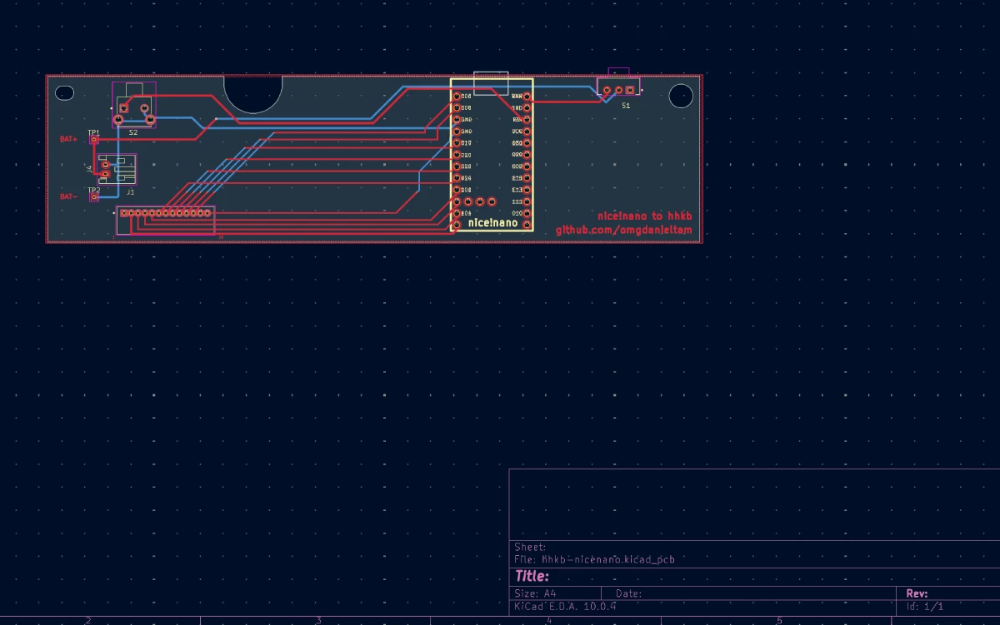 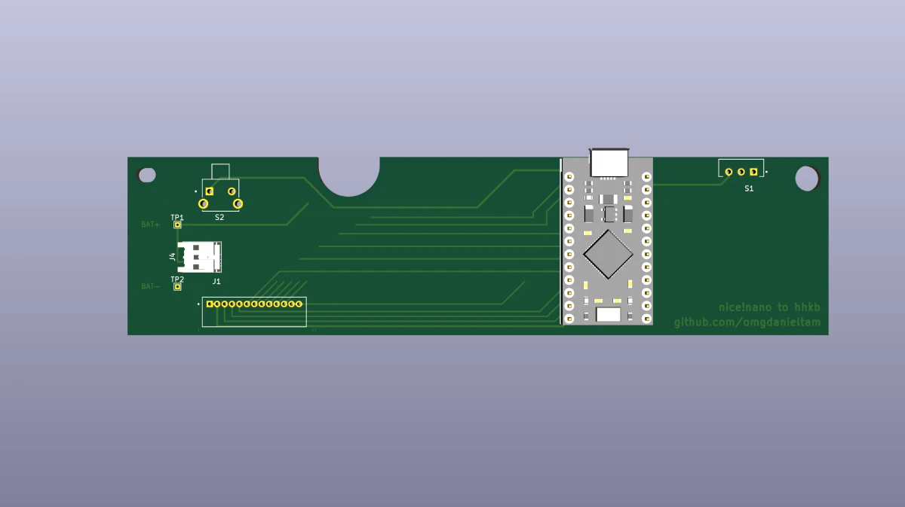

### 3D Print
I actually 3D printed my model first to test the fitment on the HHKB. This allowed me to ensure that the pieces I wanted fit where I wanted and I could make minor adjustments before sending it out to be made. Even though the through holes did not properly print, it gave me a good enough fitment to move forward.

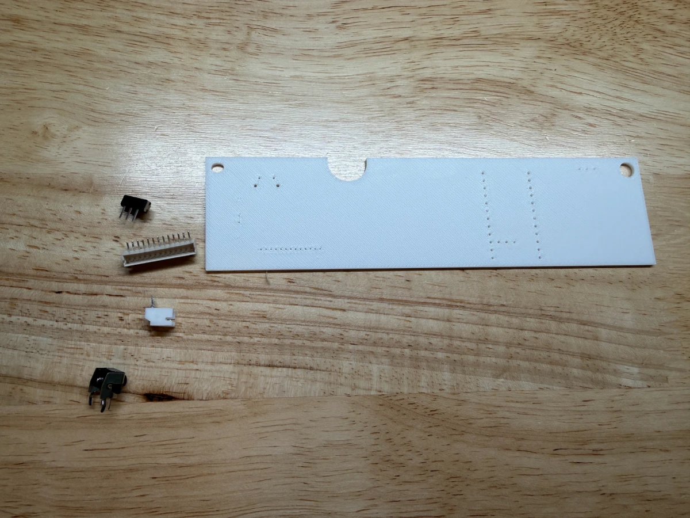 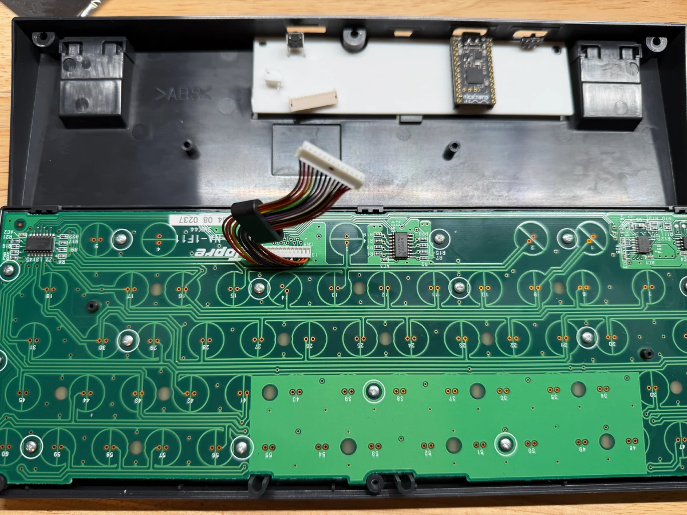

### PCB
I sent the KiCad files to get it built out at [JLCPCB](https://jlcpcb.com/). The process was relatively easy as I just uploaded my files and hit submit. They did a quick review and it was shipped out the next day and arrived in a few days. Quite the quick turnaround. Upon arrival, the PCB looks like I expected which was good news. I tested fitment on it and of course, it all fits perfectly.

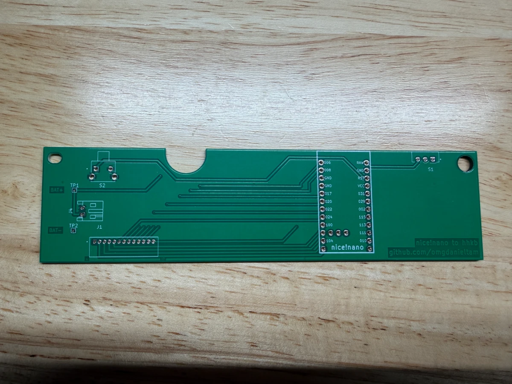 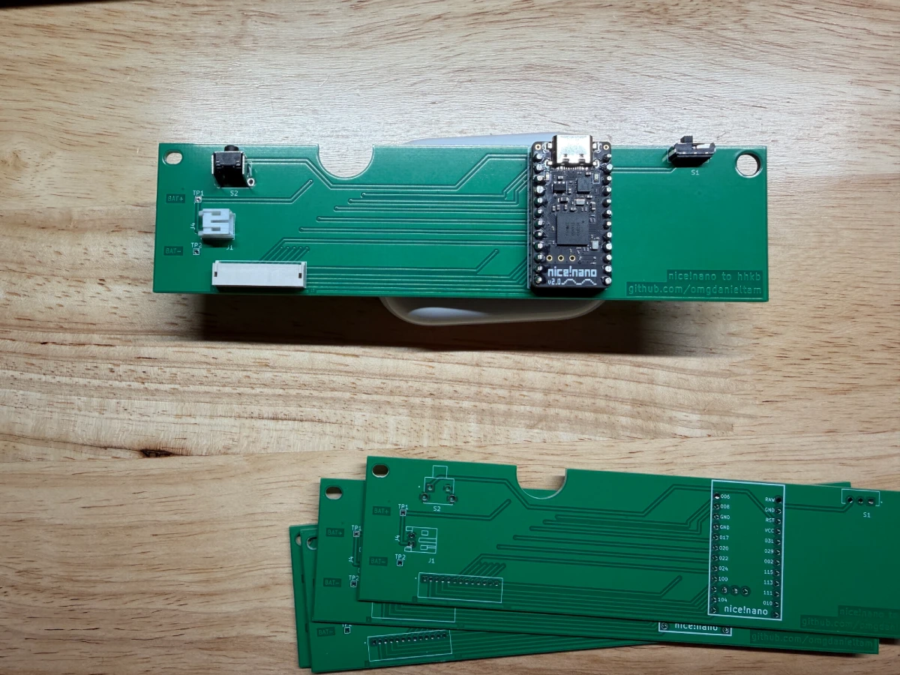

## Assembly
It was time to solder everything down. I used through hole mounts for everything as I do have any way to surface mount everything. My soldering isn't the best here, but it's good enough. I tested all my connections and it was good to go.

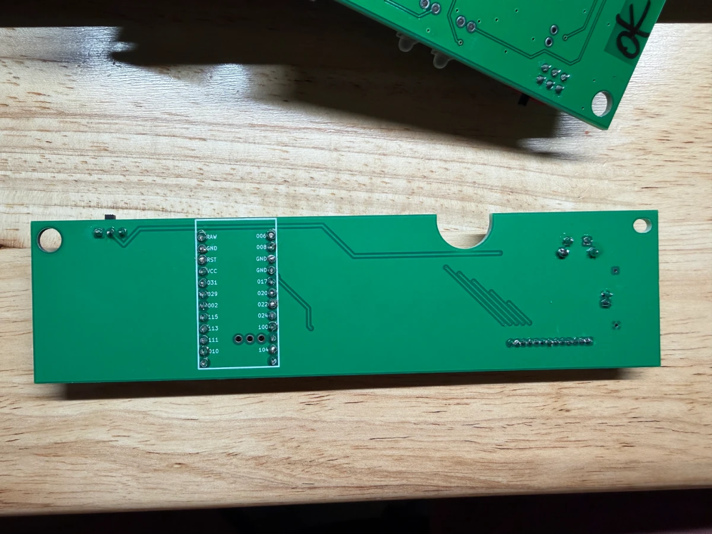

## Final assembly
Something that I realized when attempting to mount into the case was that the bottom couple pins of the through hole mount for the nice!nano was causing it not to fit in the case properly. It would not sit flush and thus cause issues with closing the case. I simply just grab some clippers and clipped off the bottom pins.

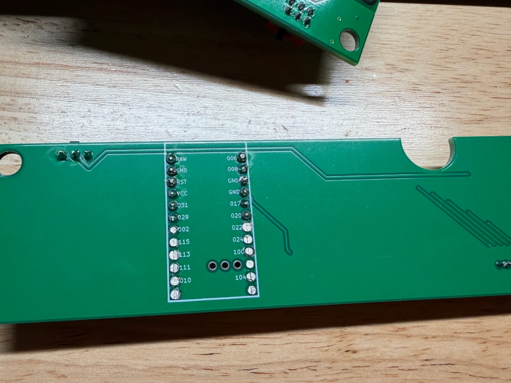 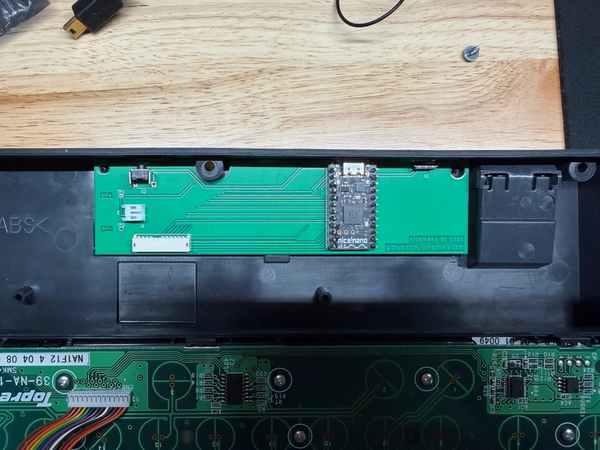 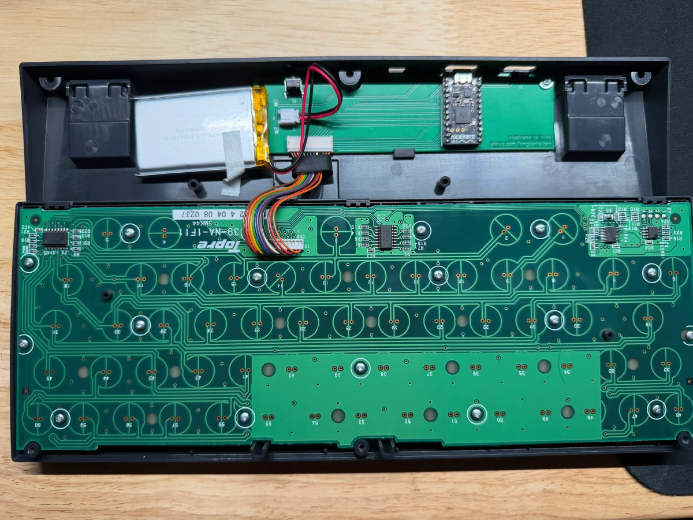

I'd need to get a cover for the mini usb port, but it's okay for now.
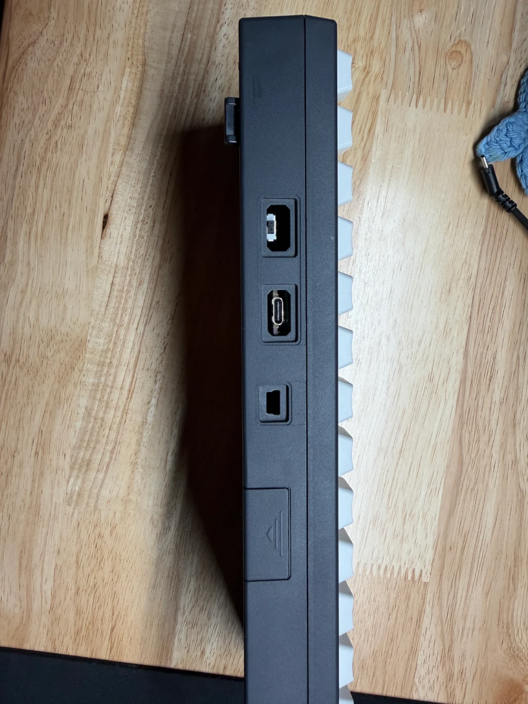

## Flashing firmware
This part was more daunting than I thought it would be. I simply just forked [kanru's](https://github.com/kanru/hhkb-zmk) code and it automatically built the firmware for it. Upon plugging it into my system, it automatically show up as a device as something that I could drop my .uf2 file onto and was good to go.

I didn't make any changes to the firmware as of right now as I'm satisfied with the default settings that kanru used. But, I did upload my KiCad files to my own [repo](https://github.com/omgdanieltam/hhkb-zmk).