+++
date = '2026-02-26T17:41:14Z'
draft = false
title = 'Flashing Lenovo ThinkCentre M920q with Coreboot'
image = 'coreboot.webp'
+++

## Introduction
I was looking into a new firewall that mainly had a 10G SFP+ ports on it as I wanted a faster connection between my firewall and my L3 switch. I was using a generic firewall mini PC that just has four gigabit ethernet ports on running pfSense. Suddenly one day during a power outage, I lost two of my four ports causing me to worry about the future of my mini PC.

After some research, I saw there were a few options that fit my bill: 10G SFP+ and x86-64 CPU (to run pfSense or OPNsense). It would be a bonus if I could also run [coreboot](https://www.coreboot.org/) as I liked the idea of running open firmware on my firewall.

There are many options I could buy from Aliexpress that contained those features costing a couple hundred $USD. [Protectli](https://protectli.com/) also fits my bill exactly with them having an option with 10G SFP+, x86-64 CPU, and a coreboot option! The only thing was a higher cost unit (over $400 USD), but it was newer hardware and well supported. With the rising cost of RAM currently, it would only increase the cost of the firewall if I were to go down that path.

I decided to look for alternatives which led me to the Lenovo ThinkCentre M920q. I saw that this unit was well supported with coreboot. The only thing that had me worry a bit was that there wasn't much documentation on getting this setup and running. I've had two previous laptops with coreboot on it (Lenovo ThinkPad x230 and Lenovo ThinkPad T420) so I'm not new to flashing coreboot onto devices. Luckily [someone](https://github.com/Thrilleratplay/coreboot-builder-scripts/blob/seabios/m920q/README.md) had some scripts to build coreboot for the M920q which saved me the trouble of having to set up everything to build coreboot.

Once I got my unit in, it was a matter of getting it taken apart and prepared to install coreboot onto it!

## Setup
A few things are needed to begin:
- A ThinkCentre M920q
- 8 Pin SOIC Clip
- Raspberry Pi 3 (Or any flasher such as a CH341A that is 3.3v)
- Female Jumper wires

Once all the hardware is acquired, it will be a matter of disassembling the M920q and hooking everything up. Easy, right?

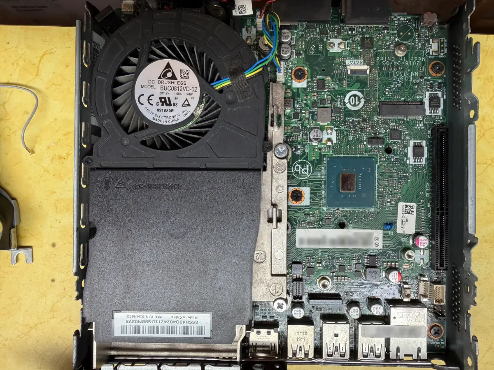

The M920q has two BIOS chips: W25Q128JV (16 MiB) and W25Q64JV (8 MiB). They are identified as below:

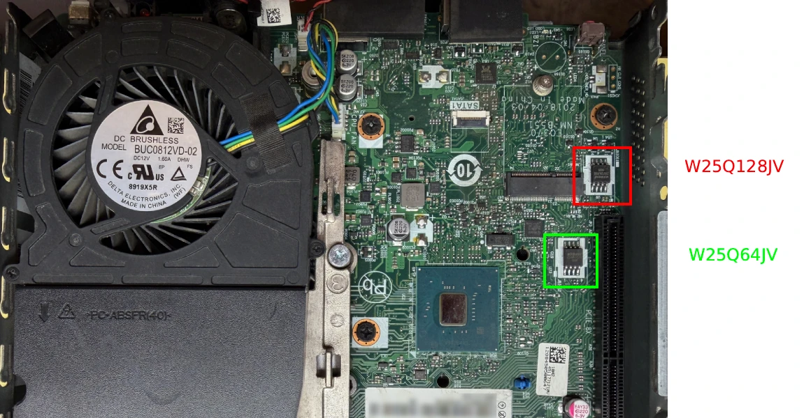

The SOIC layout for both chips are the same:

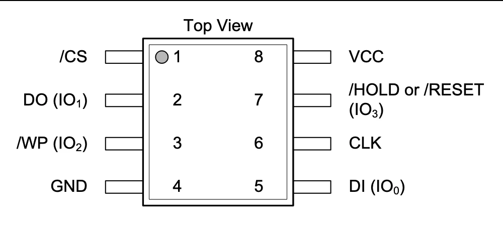

The following are the pins needed on the Raspberry Pi. Pin 1 on the Raspberry Pi is the side facing the main body, while Pin 2 is on the edge.

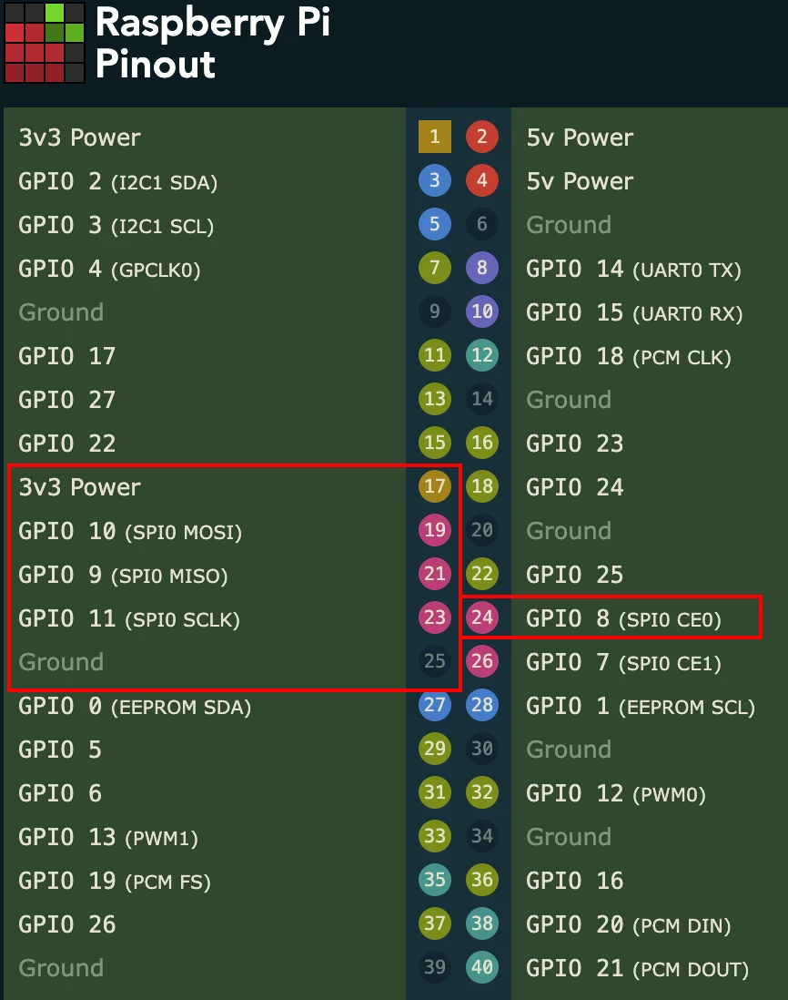

### Wiring
For wiring up the BIOS chip to the Raspberry Pi. Note that the Raspberry Pi are the pin numbers, not the GPIO pin number.
| W25Q128JV/W25Q64JV | Raspberry Pi |
|--------------------|--------------|
| 1 (CS)             | 24           |
| 2 (DO)             | 21           |
| 3 (WP)             | Not Used     |
| 4 (GRD)            | 25           |
| 5 (DI)             | 19           |
| 6 (CLK)            | 23           |
| 7 (RESET)          | Not Used     |
| 8 (VCC)            | 17 (3.3v)    |

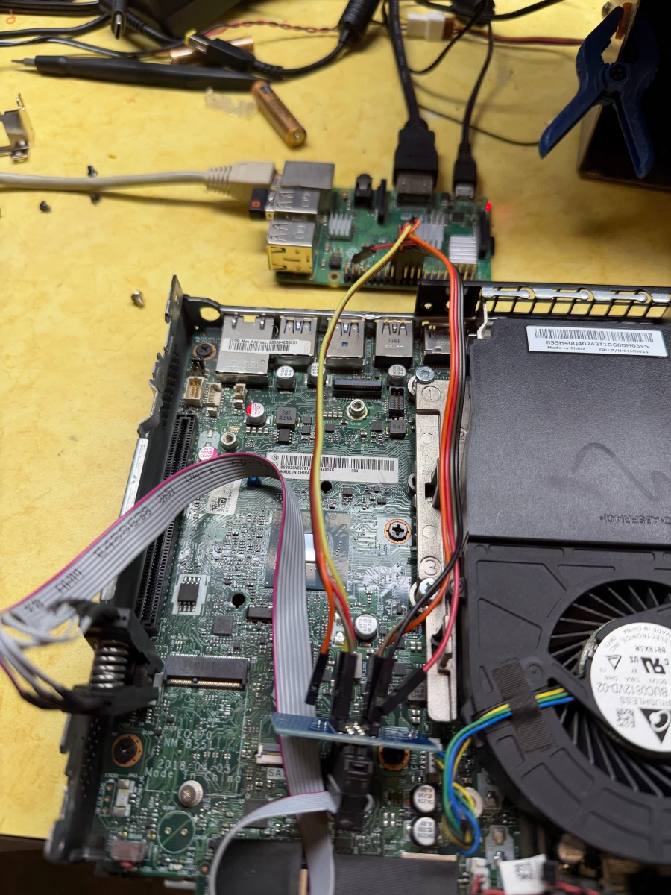

### Setup Raspberry Pi
I setup my Raspberry Pi to use just default Raspberry Pi OS based on Debian 13 (Trixie).

I mainly used this guide to get my Raspberry Pi configured: https://tomvanveen.eu/flashing-bios-chip-raspberry-pi/

It seemed like most tools were already installed (libusb, flashrom) so I didn't have to do too much other than enable SPI.


## Creating a backup
Once everything is hooked up, it's time to try to read the chips themselves.

I started with the the W25Q128JV first. To test if it's reading the chip correctly:
```
flashrom -p linux_spi:dev=/dev/spidev0.0,spispeed=512
```

Honestly, I could probably use a faster spispeed but I just followed the guide.

To read the chip and save the file:
```
flashrom -p linux_spi:dev=/dev/spidev0.0,spispeed=512 -r old_bios_1.bin
flashrom -p linux_spi:dev=/dev/spidev0.0,spispeed=512 -r old_bios_2.bin
flashrom -p linux_spi:dev=/dev/spidev0.0,spispeed=512 -r old_bios_3.bin
```

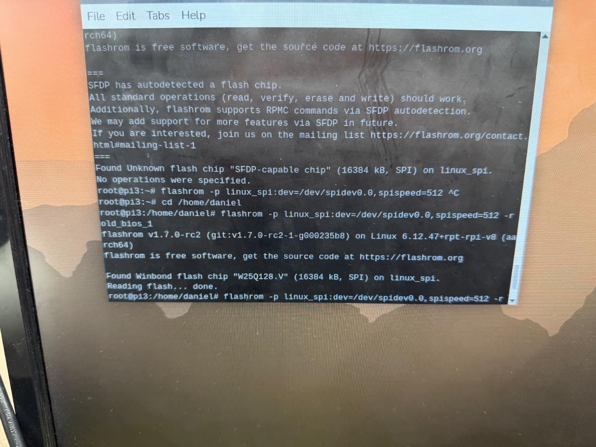

I repeated this step several times (3 times total) just in case I get different readouts since I wanted to ensure that I get the exact same dump every time.
```
sha256sum *
```

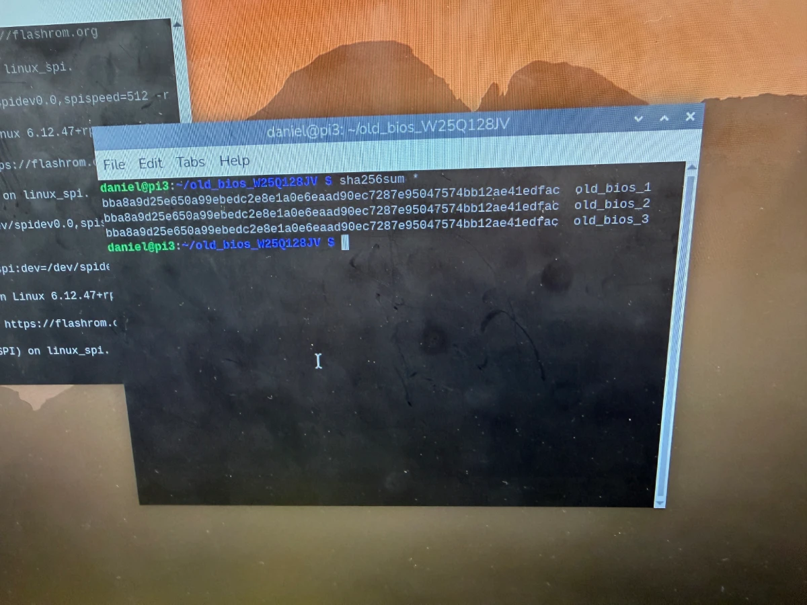

Now, following the exact same steps, I ran this for the second chip (W25Q64JV), renaming the file of course. I did realize that on the second chip, I had to specify the chip for flashrom.
```
flashrom -p linux_spi:dev=/dev/spidev0.0,spispeed=512 -c W25Q64JV-.Q -r old_bios.bin
```

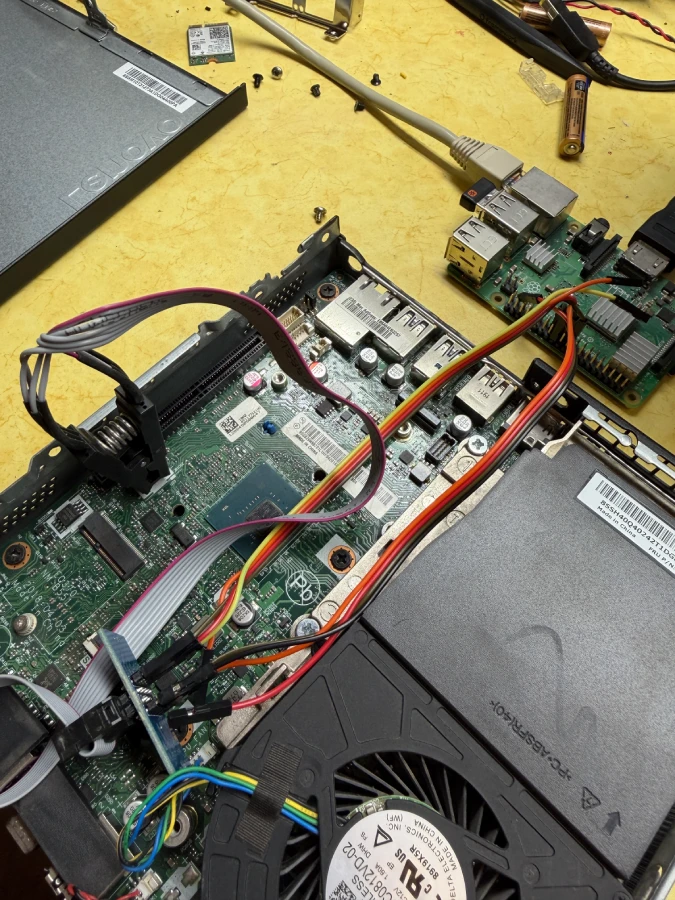 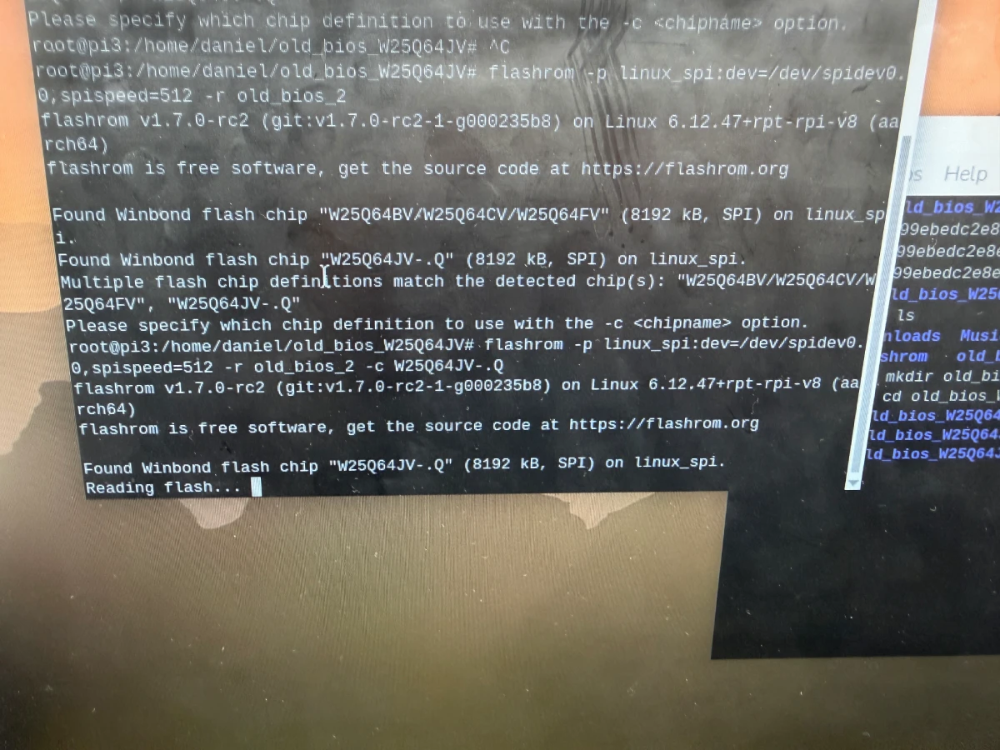

## Building Coreboot
By using the scripts provided here: https://github.com/Thrilleratplay/coreboot-builder-scripts, building coreboot was pretty straight forward. Only need to ensure `docker` is installed.

First, I would want to combine both of my BIOS ROM files into a single file. I would then want to use this as my full BIOS ROM for the future.
```
cat old_bios_w25q128jv.rom old_bios_w25q64jv.rom > full_stock_bios.bin
```

### ME Cleaner
While probably not necessary, I decided that I would clean Intel Management Engine (ME) from the BIOS. Because the chip I have is newer (Intel i5-8500t), it uses a new version of Intel ME: v12. Because of this, we cannot complete remove Intel ME, but we can set the HAP bit to tell it to be disabled at boot.

The coreboot-builder-scripts repo recommends using this specific fork of ME Cleaner: https://github.com/XutaxKamay/me_cleaner

```
git clone https://github.com/XutaxKamay/me_cleaner
```

The python script here really takes care of everything and spits back out a ROM to be used for building coreboot
```
python me_cleaner.py --soft-disable -S -O cleaned_bios.bin full_stock_bios.bin
```

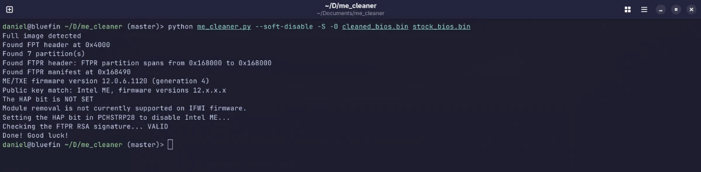

If this has successfully completed, I could build coreboot next!

### Build Coreboot
Clone down the repo to get all necessary scripts
```
git clone https://github.com/Thrilleratplay/coreboot-builder-scripts
```

First, we need to copy our stock BIOS to the folder so that it can be used to build coreboot. We will need this as there are specifics that need to be pulled from the stock ROM. This can either be the ME cleaned ROM or just the full stock BIOS ROM.

```
mkdir -p coreboot-builder-scripts/m920q/stock_bios
cp full_stock_bios.bin coreboot-builder-scripts/m920q/stock_bios.bin
```

Once copied over, we need to edit the script to use our stock BIOS. We will need to remove the comment line starting with `extractStockBios`
```
vim coreboot-builder-scripts/m920q/compile.sh
```

Now we can configure coreboot. For this, I left everything default but did follow the instructions to add:
- Intel descriptor.bin
- Add Intel ME/TXE Firmware
- Add gigabit ethernet configuration

```
./build.sh --config m920q
```

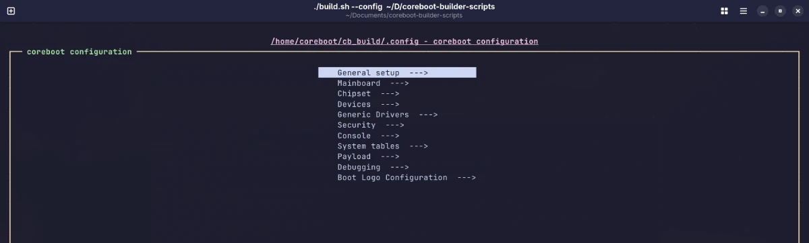 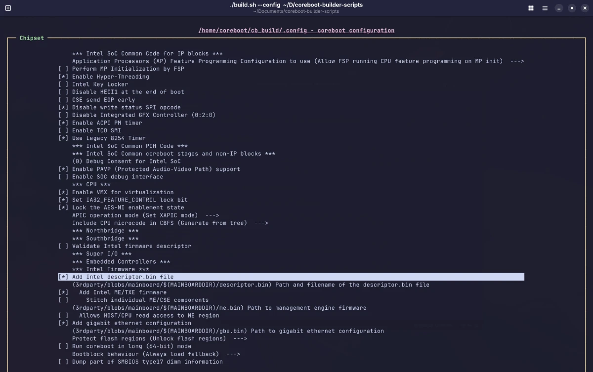

Once the build is complete, in the `coreboot-builder-scripts/m920q/build` folder, there are two files that we will need out of this. We will need to copy this to our Raspberry Pi to flash them to our m920q.
- coreboot_lenovo-m920q-chip1.rom
- coreboot_lenovo-m920q-chip2.rom

We should also copy their corresponding sha256 sums
- coreboot_lenovo-m920q-chip1.rom.sha256
- coreboot_lenovo-m920q-chip2.rom.sha256

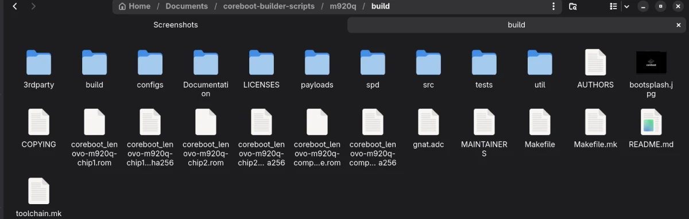

## Flashing Coreboot
Flashing coreboot at this point is pretty straightforward as we will do the opposite of reading the chips. Assuming the SOIC clip is still hooked up, we just need to flash the chips with the corresponding coreboot ROM.
```
# W25Q128JV
flashrom -p linux_spi:dev=/dev/spidev0.0,spispeed=512 -w coreboot_lenovo-m920q-chip1.rom

# W25Q64JV
flashrom -p linux_spi:dev=/dev/spidev0.0,spispeed=512 -c W25Q64JV-.Q -w coreboot_lenovo-m920q-chip2.rom
```

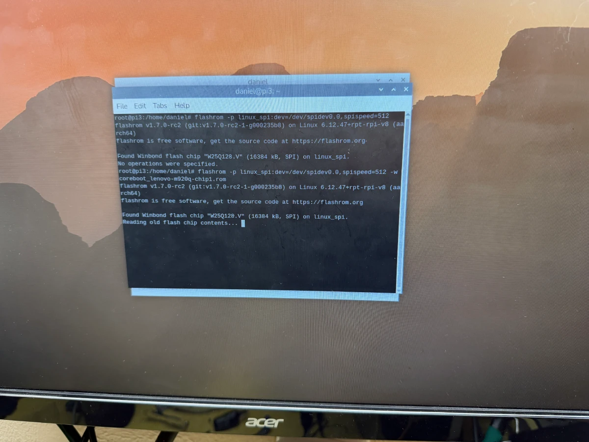

If both chips are successful, cross your fingers and boot it up!

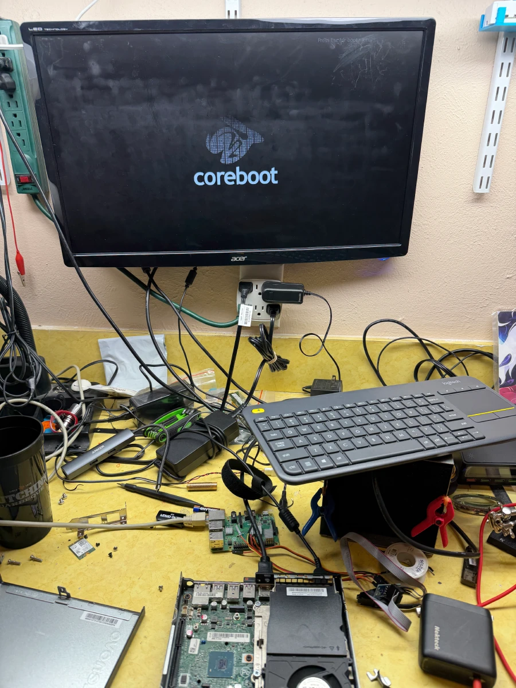