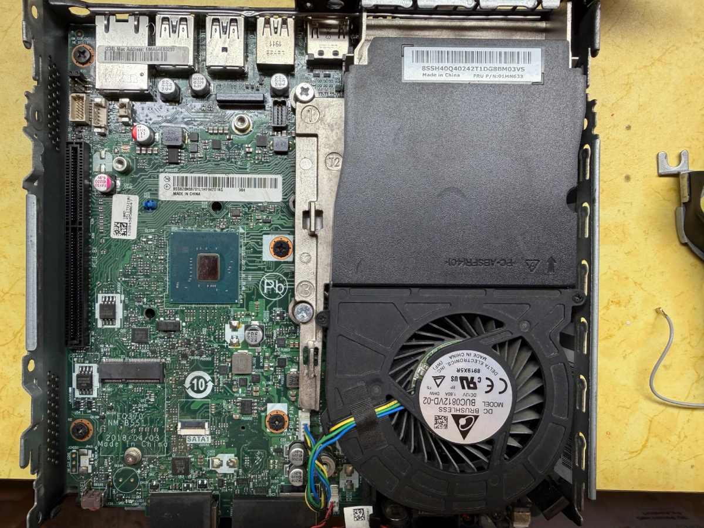
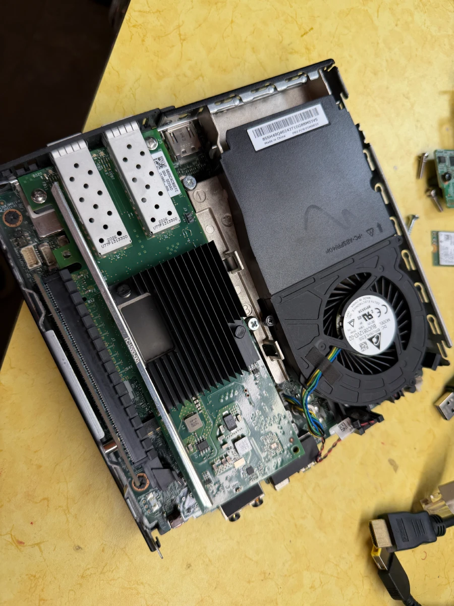
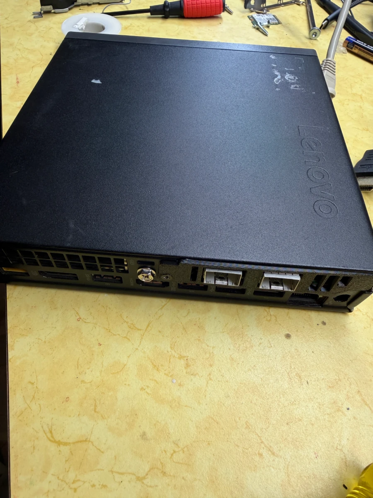
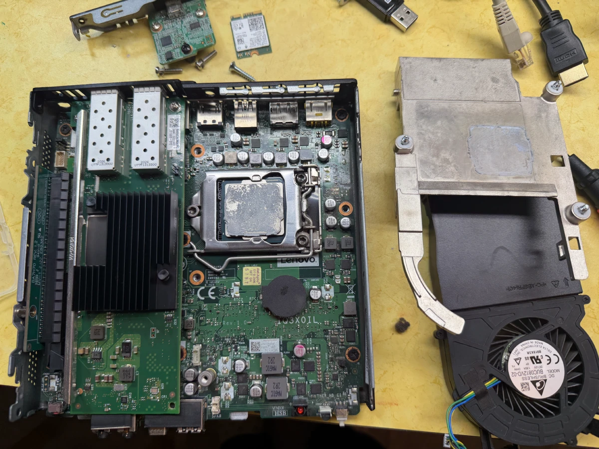
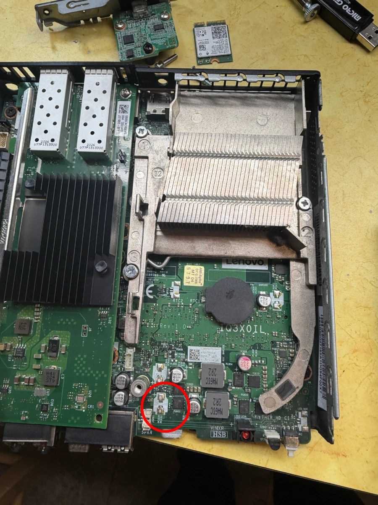
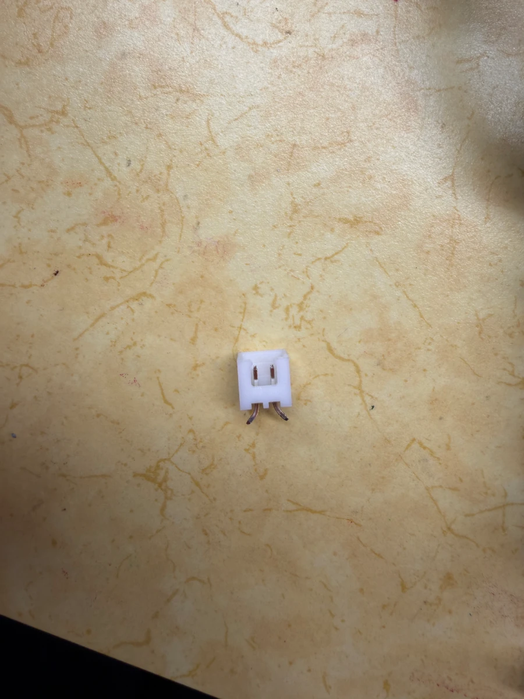
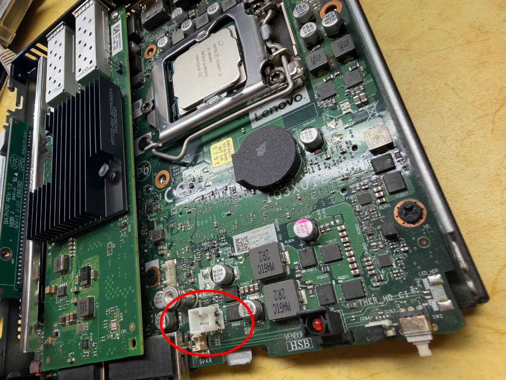
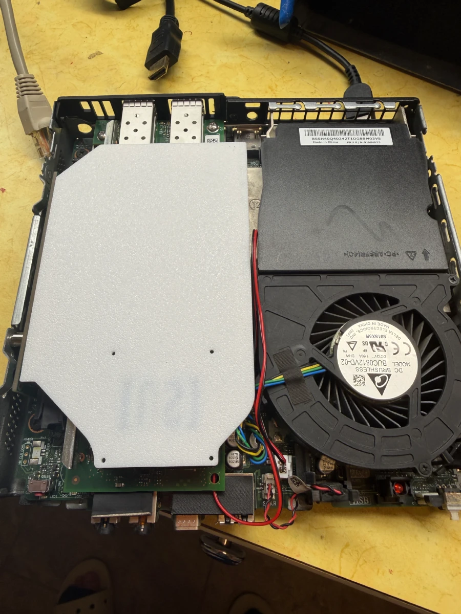

+++
date = '2026-05-17T14:51:50Z'
draft = false
title = 'Lenovo ThinkCentre M290q, pfSense, and 10GbE'
image = 'title.webp'
+++

## Introduction
A continuation of my previous post [Flashing Lenovo ThinkCentre M920q with Coreboot]().

Just to recap: I purchased a Lenovo ThinkCentre M920q with the purpose of running it as my primary firewall at home with the following specifications:
1. Running pfSense as my OS
2. Running coreboot to replace the Lenovo firmware
3. Running a 10GbE SFP+ card

## Setup
Required parts:
- Lenovo ThinkCentre M920q
  - i5-8500t and 8GB of RAM
- Intel X710-DA2
  - Lenovo 00YK615
- Lenovo ThinkCentre PCIE Riser Card
- 3D Printed Parts
  - [M920q Bracket](https://www.thingiverse.com/thing:6751192)
  - [Fan Shroud](https://www.printables.com/model/561920-lenovo-tiny-fan-shroud/comments/1148445)
- Cooling Parts
  - [4010 Blower Fan](https://www.aliexpress.us/item/3256803813414106.html)
  - 2 Pin header
  - 4 screws

## Assembly
Most of this really just putting pieces together once you have all the required parts. My M920q came with an expansion card taking up the PCIe slot, so removal of that was necessary which freed up the PCIe slot once again.

Once that was removed, it's a matter of connecting the Intel X710-DA2 to the riser and plugging it in.

The 3D printed bracket holds the card in place in the back and allows for some airflow.

## Cooling
From what I've read, the Intel X710 runs a lot cooler than the previous models (Intel X520) and thus may not need a cooling fan. But, my environment where my firewall will be is going to be warmer most of the time (it's basically a closet) and so I wanted an active cooler for it. This will use more electricity, but I wanted to have it for the health of my card at least since I'm also running a 10GbE SFP+ to RJ45 for now since I only get RJ45 for my internet currently.

### Finding power
In order to get space and find a somewhere to source power, I first removed the original cooling fan for the CPU.

With the cooler removed, it was a matter of finding a power source. Honestly, I kind of lucked out and just tested a random pad that I saw said `+`. Then the pad next to it as well. When powered on, it was providing 5v power! Conveniently enough for me, this was not too far so I could utilize it. I can't say how much amperage I could push through this, but I'm just hoping for the best.

My fan had a two pin header, and I luckily also had a female 2 pin header I could use. Since I was soldering straight to the board, I did have to bend the pins so I could solder to it and since it was a bit wider.

 

With that, it was as matter of assembling the fan, putting the CPU fan back on, and connecting it up. 

## Finale
That's really about it. It was pretty simple and straightforward. I have been running pfSense previously so it was really just restoring my old config to this new box. Maybe a few configuration changes needed since the adapter changed, but nothing really different. It was able to detect the Intel X720-DA2 on pfSense out of the box.

I haven't really ran any performance tests but I'll just assume that it's working amazingly.