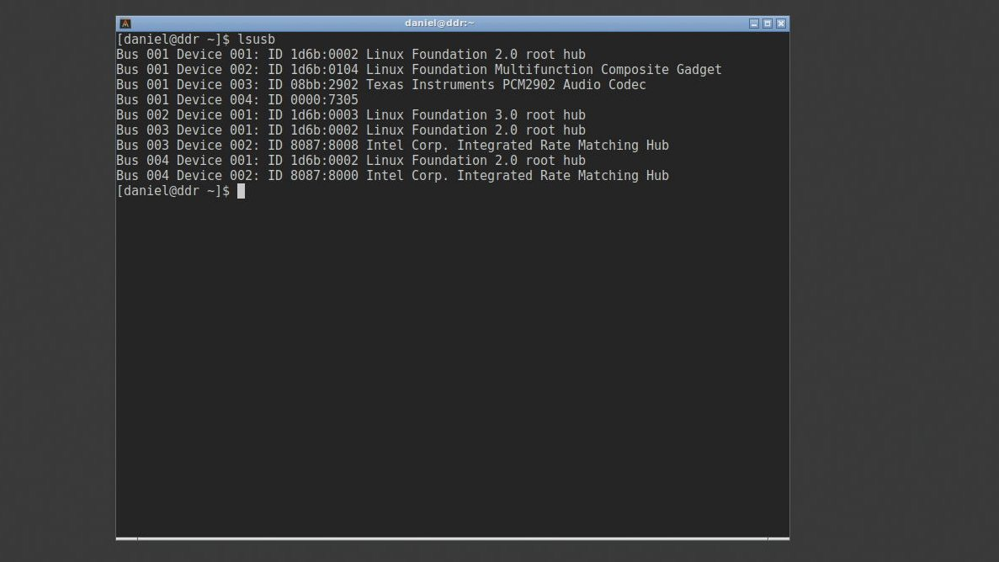
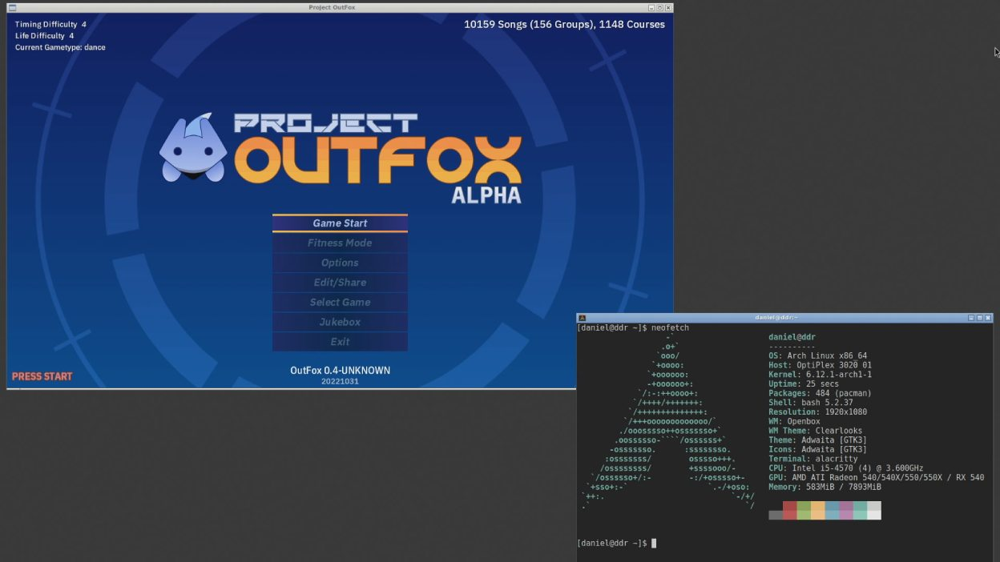
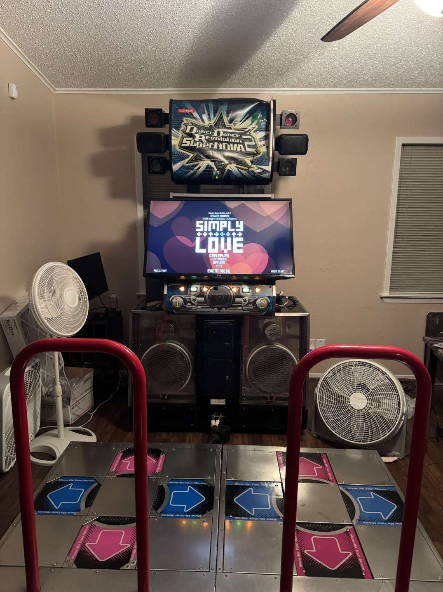

+++
date = '2024-11-27T00:09:41-06:00'
draft = false
image = 'banner.jpg'
title = 'Project OutFox on Arch Linux with Betson P2IO'
+++

## Introduction
I previously purchased a Betson Supernova 2 almost complete with working hardware except a monitor (that nice Kortek monitor 😔). And while I do enjoy older DDR mixes, I'm a big fan of custom tracks and perfer to have Stepmania install. I ran the [Stepmania Starworlds](https://github.com/chrispable/stepmania/tree/starworlds) branch for a while but the branch is no longer updated so it was up to other forks to implement the P2IO/P3IO library.

This is when I found out about [Project OutFox](https://projectoutfox.com/) which is a continuation of Stepmania 5. This is when I found out that I **had** to run Windows 7 and that I got lucky last time running Starworlds that I installed it onto a Windows 7 machine. Without knowing the full technical details, it had something to do with the USB stack in anything above Windows 7. So I did what everyone else did, installed Windows 7 onto my old Dell Latitude E6420 laptop, hooked everything up and played Stepmania.

Now since I was running older hardware, I started to run into some hardware related issues. Performance was not great with the hardware I had, and I didn't want to buy some other old hardware that may potentionally be better. I did have something a little better with a Dell Optiplex 3020 I had with an Intel i5-4570 and then I had a spare video card with a AMD RX550. While the hardware isn't great, it's better. At first I put Windows 7 onto it and while the performance did improve, it wasn't great still.

Project OutFox did have Linux builds, but it didn't really seemed that anyone was running the Linux version of Project OutFox with a Betson P2IO. I put Xubuntu 24.04 onto a drive, installed it onto a spare SSD I had and gave it a try. To my surprise, it worked without any issues. Now I wanted to build my own Stepmania machine with Arch Linux to give it the customization I wanted.

## Arch Linux Setup
I've set up Arch Linux a few too many times and was a bit lazier now to run through the wiki and do the manual install. I saw they introduced the `archinstall` script so I decided to try that out. During the setup, I selected Pipewire as the audio server and NetworkManager as the network manager. archinstall was pretty simple and easy, giving me a full working Arch Linux machine quickly.

While I can make my system more "secure", this is going to be at my home which I'm protected by my own firewall and network configurations. So my setup is going to be pretty open and not very secure because I want it to be easier for me to work on this machine at a later time.

#### Post-install
Fixing my user groups:
```bash
sudo usermod -aG audio,video,input,wheel <username>
```

For the programs I installed:
```bash
sudo pacman -S xorg xorg-apps xorg-xinit thunar firefox xterm alacritty vim nano wget openssh arandr pavucontrol alsa-utils leafpad usb-utils
```

---

### Openbox
I was reading a bit and found that compositors sometimes cause extra latency and may not be the best for pure performance. This ruled out Wayland as those compositors are linked together so I was going to stick with Xorg. I decided that Openbox would be a great choice as it's a barebones windows manager that is easy to configure.

Following the Arch Linux [Openbox Wiki](https://wiki.archlinux.org/title/Openbox), I configured my Openbox setup. I wanted a simple menu config that has almost nothing in it.

Installing Openbox:
```bash
sudo pacman -S openbox ttf-dejavu ttf-liberation
```

Copying config files over:
```bash
mkdir -p ~/.config/openbox
cp -a /etc/xdg/openbox ~/.config/
```

Editing the Openbox menu:
```bash
sed -i '374,$d' ~/.config/openbox/menu.xml
vim ~/.config/openbox/menu.xml
```

```bash
...
<menu id="root-menu" label="Openbox 3">
  <item label="Project OutFox 0.4.18.1">
    <action name="Execute">
      <command>/home/<username>/Project_OutFox-0.4.18.1/OutFox</command>
      <startupnotify>
        <enabled>yes</enabled>
      </startupnotify>
    </action>
  </item>
  <separator />
  <item label="Terminal">
    <action name="Execute">
      <command>alacritty</command>
      <startupnotify>
        <enabled>yes</enabled>
      </startupnotify>
    </action>
  </item>
  <item label="File Explorer">
    <action name="Execute">
      <command>Thunar</command>
      <startupnotify>
        <enabled>yes</enabled>
      </startupnotify>
    </action>
  </item>
  <item label="Notepad">
    <action name="Execute">
      <command>leafpad</command>
      <startupnotify>
        <enabled>yes</enabled>
      </startupnotify>
    </action>
  </item>
  <item label="Internet Browser">
    <action name="Execute">
      <command>firefox</command>
      <startupnotify>
        <enabled>yes</enabled>
      </startupnotify>
    </action>
  </item>
  <separator />
  <item label="ARandR">
    <action name="Execute">
      <command>arandr</command>
      <startupnotify>
        <enabled>yes</enabled>
      </startupnotify>
    </action>
  </item>
  <item label="pavucontrol">
    <action name="Execute">
      <command>pavucontrol</command>
      <startupnotify>
        <enabled>yes</enabled>
      </startupnotify>
    </action>
  </item>
  <separator />
  <item label="Log Out">
    <action name="Exit">
      <prompt>yes</prompt>
    </action>
  </item>
  <item label="Reboot">
    <action name="Execute">
      <command>sudo shutdown -r now</command>
      <prompt>Reboot?</prompt>
    </action>
  </item>
  <item label="Shutdown">
    <action name="Execute">
      <command>sudo shutdown -h now</command>
      <prompt>Shutdown?</prompt>
    </action>
  </item>

</menu>

</openbox_menu>
```

---

### Configurations
I needed a few more configurations to the Arch Linux install to get everything set up

[xinitrc](https://wiki.archlinux.org/title/Xinit) to properly start Openbox:
```bash
cp /etc/X11/xinit/xinitrc ~/.xinitrc
vim ~/.xinitrc
```

```bash
...

#twm &
#xclock -geometry 50x50-1+1 &
#xterm -geometry 80x50+494+51 &
#xterm -geometry 80x20+494-0 &
#exec xterm -geometry 80x66+0+0 -name login
exec openbox-session &
xset -dpms
xset s off
xset s noblank
```

[OpenSSH](https://wiki.archlinux.org/title/Dropbear) so that I can remote into the machine over SSH:
```bash
sudo systemctl --now enable sshd
```

sudo configuration:
```bash
sudo vim /etc/sudoers.d/shutdown
```
```bash
ALL     ALL=NOPASSWD:/sbin/shutdown
```

---

### Project OutFox
I had a few issues running Project Outfox previously on any version above 0.4.18. While it still works, some things such as the lights would be stuck on. It seems that above 0.4.18, there were some changes to the P2IO/P3IO stack. For now, I'll continue to run an older version just in case.

#### Installation
The official [install guide](https://outfox.wiki/en/user-guide/setup/install-linux) is pretty helpful. The [AUR](https://aur.archlinux.org/packages/outfox_bin) has a version of Project OutFox on it, but it's the latest version, not something we would want.

```bash
sudo pacman -S ffmpeg libusb-compat lua
```

```bash
cd ~
wget https://github.com/TeamRizu/OutFox/releases/download/0.4.18.1/OutFox-0.4.18.1.LTS-Linux-amd64-date-20221101.tar.gz
tar -xzf OutFox-0.4.18.1.LTS-Linux-amd64-date-20221101.tar.gz
mv OutFox-alpha-0.4.18.1-amd64-date-20221101 Project_OutFox-0.4.18.1
rm OutFox-0.4.18.1.LTS-Linux-amd64-date-20221101.tar.gz
```

#### Configuration
An initial start of Project OutFox may be needed to create the save file that needs to edited.
```bash
vim ~/.project-outfox/Save/Preferences.ini
```
```
...
InputDrivers=Python23IO
...
Python23IO_Mode=SDP2IO
...
```

#### USB udev rules
Initially, Project OutFox will not have access to the USB device as it is mounted as a root user. I use [udev](https://wiki.archlinux.org/title/Udev) rules to mount the USB device so that it is accessible by everyone. I needed to first find the USB device and get it's vendor and product ID to make an udev rule for it. I use `lsusb` to identify the USB devices:



I assumed it was the empty match and use that vendor and product ID (not sure if this is the same across all P2IOs).

```bash
sudo vim /etc/udev/rules.d/71-device-name.rules
```
```bash
SUBSYSTEMS=="usb", ATTRS{idVendor}=="0000", ATTRS{idProduct}=="7305", MODE="0666", TAG+="uaccess"
```
---

### Final configuration
I wanted my system to automatically log in and start Outfox upon turning on.

#### Auto login into terminal
Since I'm not using a display manager, I need to log into the [virtual terminal](https://wiki.archlinux.org/title/Getty#Automatic_login_to_virtual_console) automatically:

```bash
sudo mkdir -p /etc/systemd/system/getty@tty1.service.d/
sudo vim /etc/systemd/system/getty@tty1.service.d/autologin.conf
```

```bash
[Service]
ExecStart=
ExecStart=-/sbin/agetty -o '-p -f -- \\u' --noclear --autologin username %I $TERM
```
#### Auto start Xorg
Once auto login is completed, I need to make [Xorg](https://wiki.archlinux.org/title/Xinit#Autostart_X_at_login) automatically start Openbox:

```bash
vim ~/.bash_profile
```
```bash
...
if [ -z "$DISPLAY" ] && [ "$XDG_VTNR" = 1 ]; then
  exec startx
fi
```

#### Auto start Project OutFox
Now that it auto logs into [Openbox](https://wiki.archlinux.org/title/Openbox#Autostart), I'll have it start Project OutFox:

```bash
vim ~/.config/openbox/autostart
```
```
/home/<username>/Project_OutFox-0.4.18.1/OutFox
```

---
Probably just a reboot to finish everything off and make sure it all works.



## Final Notes
- Songs are all stored within the `/home/<username>/Project_OutFox-0.4.18.1/Songs` folder.
- Themes are all stored within the `/home/<username>/Project_OutFox-0.4.18.1/Appearance/Themes` folder
- Save files are stored within then `/home/<username>/.project-outfox/Save` folder

