+++
date = '2024-12-21T07:32:16Z'
draft = false
title = '3D Printed Sound Voltex Controller'
image = 'top-button-install.webp'
+++

# Introduction
I recently attended a get together with some friends and we were going to have a [white elephant](https://en.wikipedia.org/wiki/White_elephant_gift_exchange) event. I wanted to create something kind of unique that hopefully someone would enjoy and something that I liked as well. I thought something rhythm game related would be kind of neat to have. We had a $60 maximum so it kind of limited what I could do. I figured that since I have a 3D printer, maybe I could print something that would be neat.

I looked through some projects and found that someone put files for a Sound Voltex controller on their [Github](https://github.com/Umi4Life/SDVX-AC-Case). This looked perfect for me. I knew that if I bought buttons and encoders from Aliexpress, it could be pretty cheap. After some quick calculations, I found that it would be about $30 for the required buttons, switches, LEDs, encoders, and knobs. All I needed after that was printer filament, an acrylic top piece, screws, and an Arduino. 

I admit I cheated the $60 limit a tad bit since I had some many parts on-hand. I had printer filament, screws, and an Arduino on had. Granted, these parts are pretty low cost so it's hard to say exactly. But the acrylic top piece cost me $20 to get laser cut and shipped. Overall, it was going to be close to the limit (close enough at least). I opted the skip the art as it would increase the cost, and it looks kind of neat as just 3D printed piece.

# Parts List
While not conclusive, these were the parts that I needed to build the controller

## Purchased
- 4x [60mm x 60mm Square Button](https://www.aliexpress.us/item/3256805956615821.html)
- 2x [50mm x 30mm Retangular Button](https://www.aliexpress.us/item/3256806623120120.html)
- 1x [33mm x 33mm Square Button](https://www.aliexpress.us/item/3256806623339055.html)
- 7x [5V LED White](https://www.aliexpress.us/item/3256806072585560.html)
- 2x [Rotary Encoder 600PPR](https://www.aliexpress.us/item/3256804885456907.htm)
- 2x [30mm x 25mm Aluminum Knob](https://www.aliexpress.us/item/3256805495161938.html)
- 6x [Latch Magnets](https://www.ebay.com/itm/115464091609)
- Acrylic from local shop

## On-Hand
- 7x Arcade Microswitch
- Lots of M3x8mm screws
- Arduino Leonardo
- 26AWG Wire
- Terminal Connectors
- [Sunlu PLA Plus Filament](https://www.amazon.com/SUNLU-Printer-Filament-Dimensional-Accuracy/dp/B08CVG79JM)
- Panel mount USB connector

# Printing
Printing the base of the controller was pretty simple. I followed the instructions on the Github repo. (Sorry, I forgot to take pictures)

# Assembly
Asslembling the controller was pretty straight forward. There aren't too many parts to this and the 3D printed base case makes it pretty easy to figure out the direction of all the parts and how they all fit together.

I attached the back shield with the panel mount connector, screwed in the rotary encoder through the top. I also used some screws and nuts to attach the pieces together.

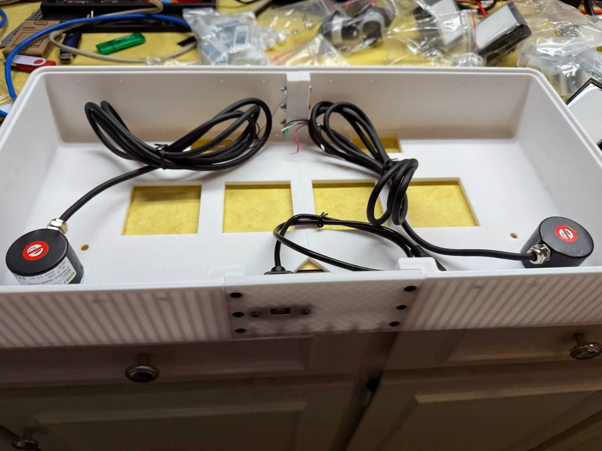

Now is also a good time to install the magnets. I kind of forgot to do it right now and installed the buttons first which made it harder to screw in the magents. Don't make this mistake! To install the buttons, you'll need to unscrew the buttons so you can fit it through. Then you can put the acrylic piece down and put the button through it.

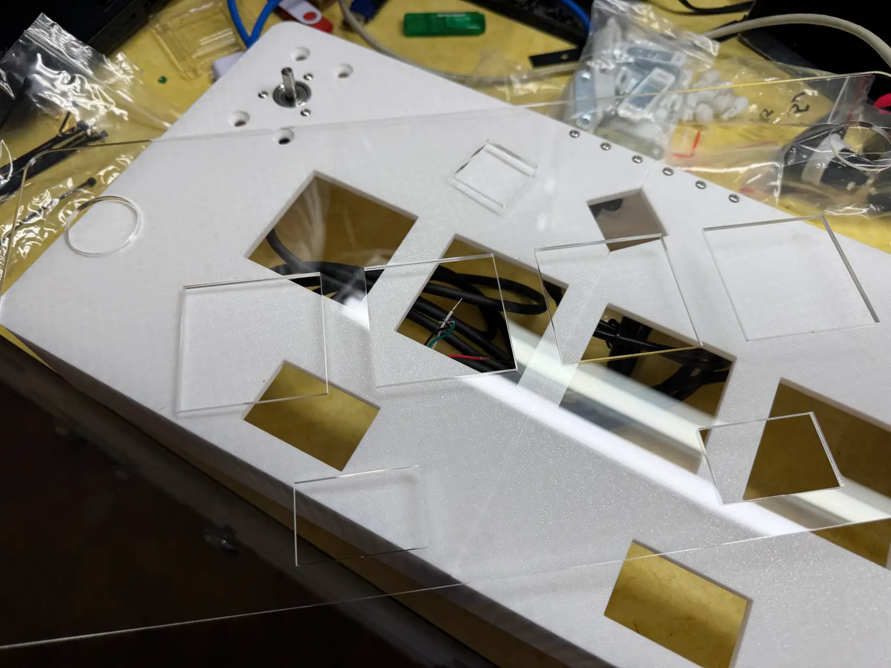 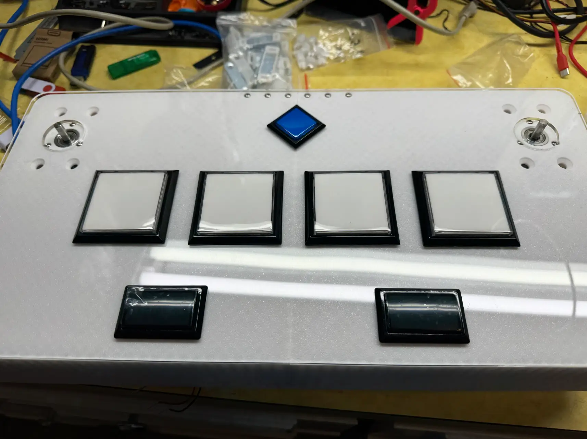

At this point, the inside should be something like this:

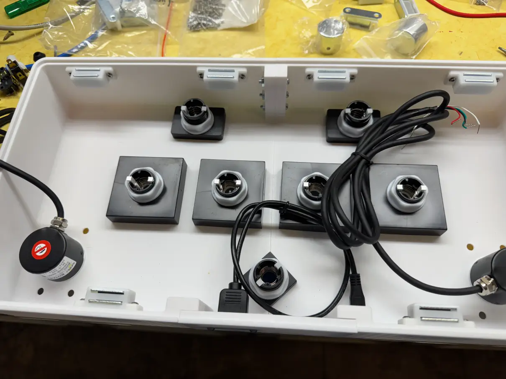

We can now put the switches together. Also make sure to make the positive and negative on the LEDs! I just made a mark with a sharpie so that I could locate it later.

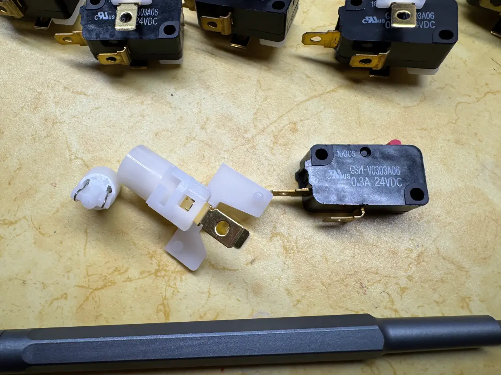 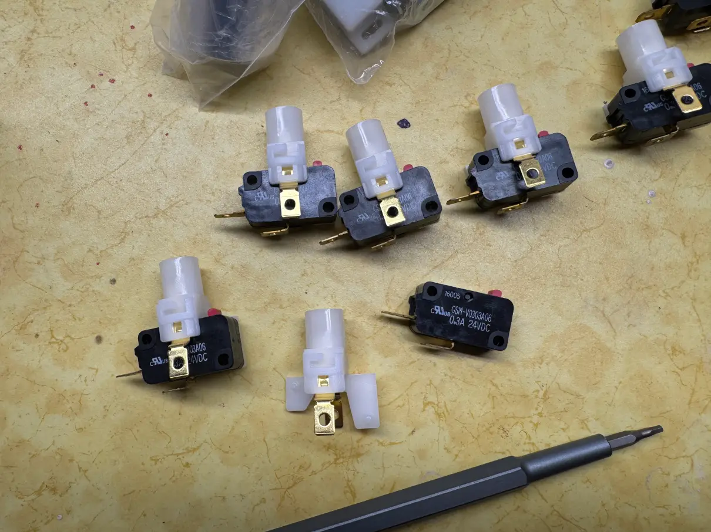

Once the switches are put together, it can be installed onto the buttons. It's a simple twist on:

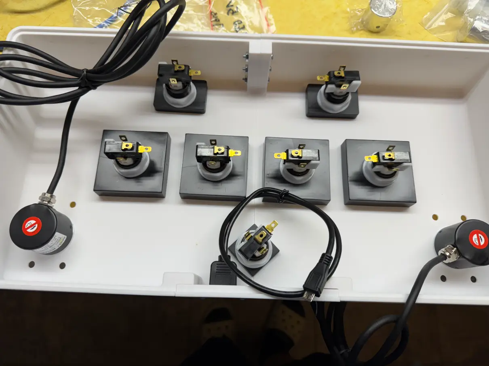

Now to begin the wiring. I used the terminal connectors to connect my wires to the buttons so that I wouldn't need to solder them to the microswitch. 

Each button has 4 connectors that need to be connected up. They are: LED+ (5V), LED- (GRD), COM (GRD), NO (5V). The 5V will plug into a pin on the Arduino (not the 5V). This is because the fireware we are going to use supports HID lighting so the software will control the lights. When a button is pushed down, the NO (Normally open) wire on the microswitch will then short to ground. The Arduino will read this short to ground as an input. The Arduino will then send a signal to the LED+ pin to turn the LED on.

The wiring will be something along the lines of wiring all the grounds together (both from the COM on the microswitch and the LED-). These can be daisy chained since it will all be a common ground. The LED+ will be wired straight into the Arduino (for example onto PIN 5). The NO will be wired straight into the Arduino (for example onto PIN 6).

A *very* crude drawing of the diagram:

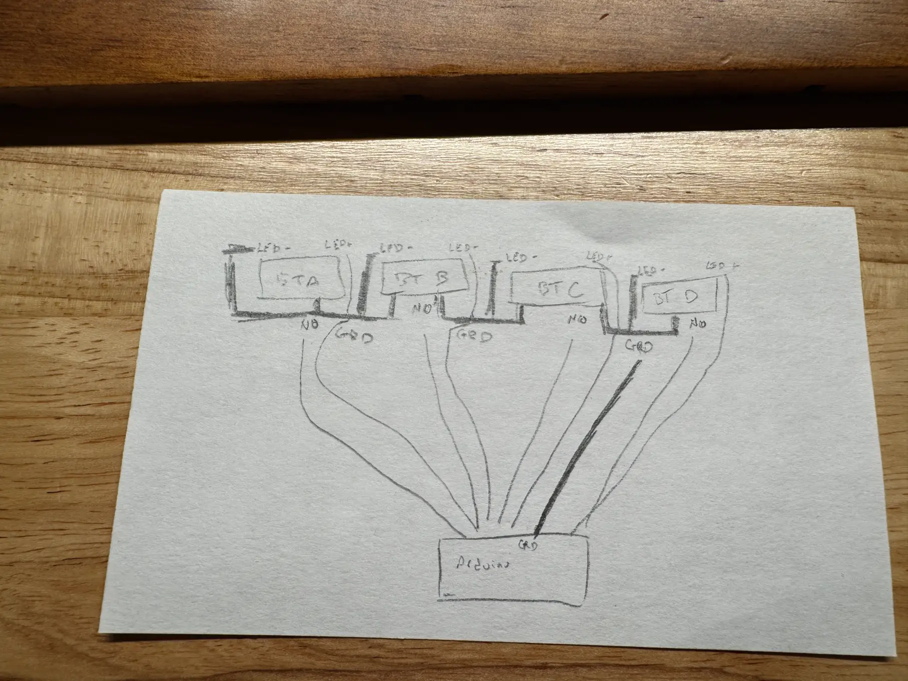

I then wired all the grounds together for both common on the microswitch and the negative on the LED. This is then wired into the negative of the LEDs. This is then wired into the ground on the Arduino. Then the postive of the LED has a separate wire from the normally open pin on the microswitch. All these wires are wired into the Arduino.I also wired up the encoders according to the text on the encoder (5v, GRD, A, B).

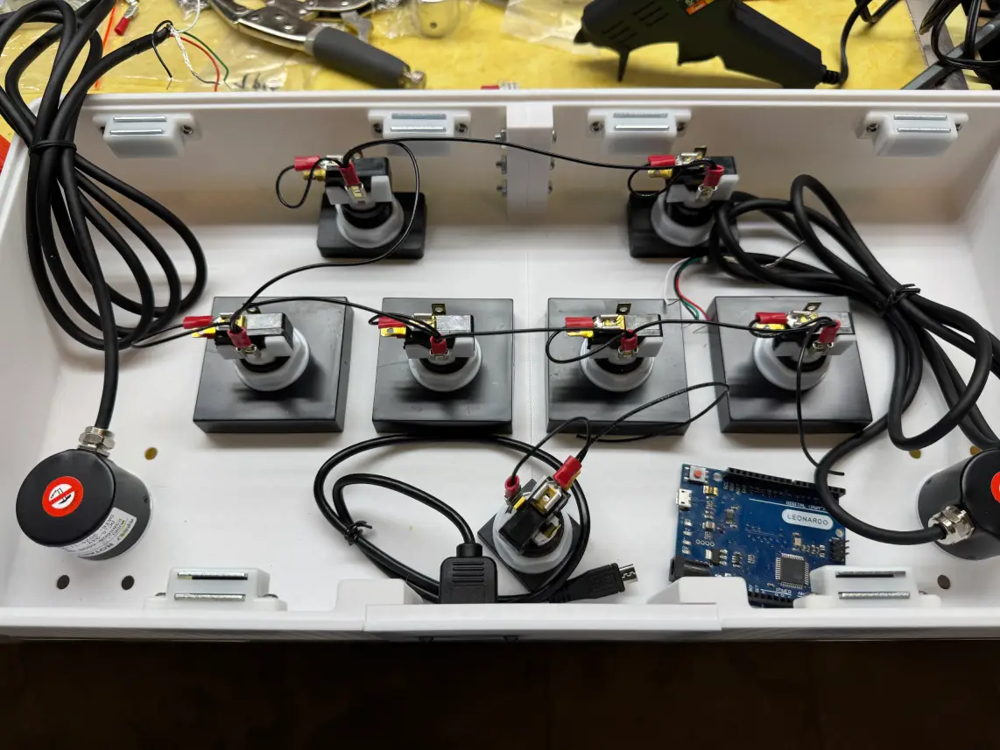 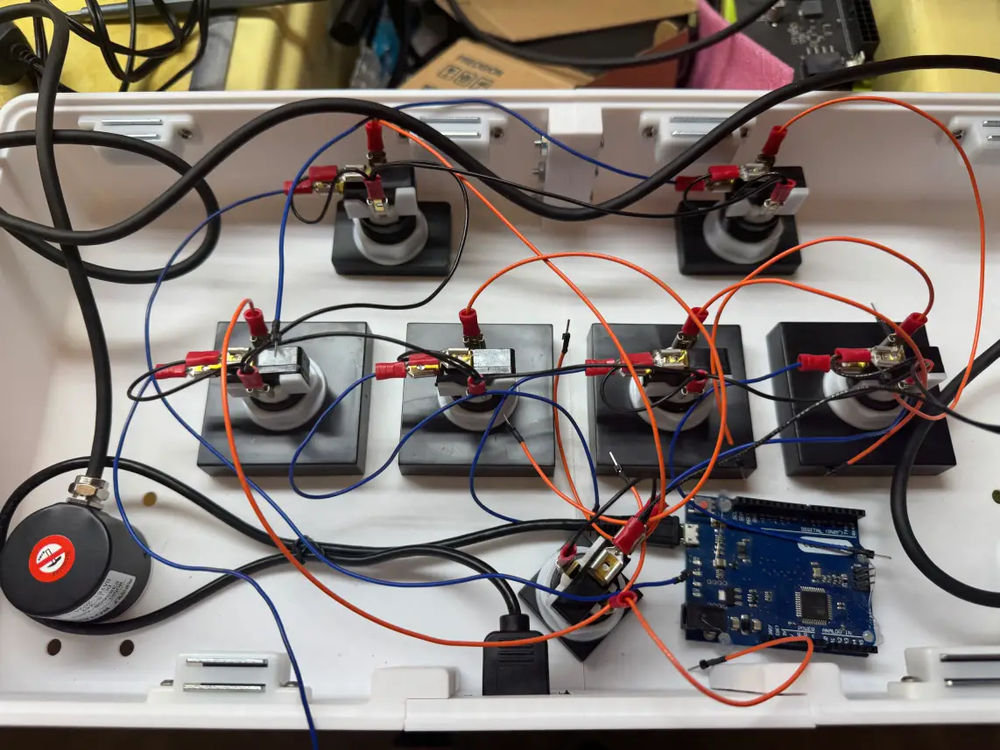

Based on the [firmware](https://github.com/knuckleslee/RhythmCodes/tree/master/2E10B10LED_sdvx/leo), the wiring I used was:
```
Encoder L (A)   -> PIN 0
Encoder L (B)   -> PIN 1
Encoder L (GRD) -> GRD
Encoder L (5V)  -> 5V
Encoder R (A)   -> PIN 2
Encoder R (B)   -> PIN 3
Encoder R (GRD) -> GRD
Encoder R (5V)  -> 5V
BT-A LED+       -> PIN 4
BT-A NO         -> PIN 5
BT-A COM        -> GRD
BT-A LED-       -> GRD
BT-B LED+       -> PIN 6
BT-B NO         -> PIN 7
BT-B COM        -> GRD
BT-B LED-       -> GRD
BT-C LED+       -> PIN 8
BT-C NO         -> PIN 9
BT-C COM        -> GRD
BT-C LED-       -> GRD
BT-D LED+       -> PIN 10
BT-D NO         -> PIN 11
BT-D COM        -> GRD
BT-D LED-       -> GRD
FX-L LED+       -> PIN 12
FX-L NO         -> PIN 13
FX-L COM        -> GRD
FX-L LED-       -> GRD
FX-R LED+       -> PIN 14 (A0)
FX-R NO         -> PIN 15 (A1)
FX-R COM        -> GRD
FX-R LED-       -> GRD
START LED+      -> PIN 16 (A2)
START NO        -> PIN 17 (A3)
START COM       -> GRD
START LED-      -> GRD
```
Using the Arduino IDE, you can flash the firmware as is. The finished result:

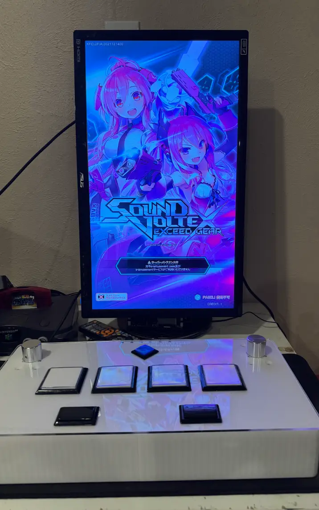