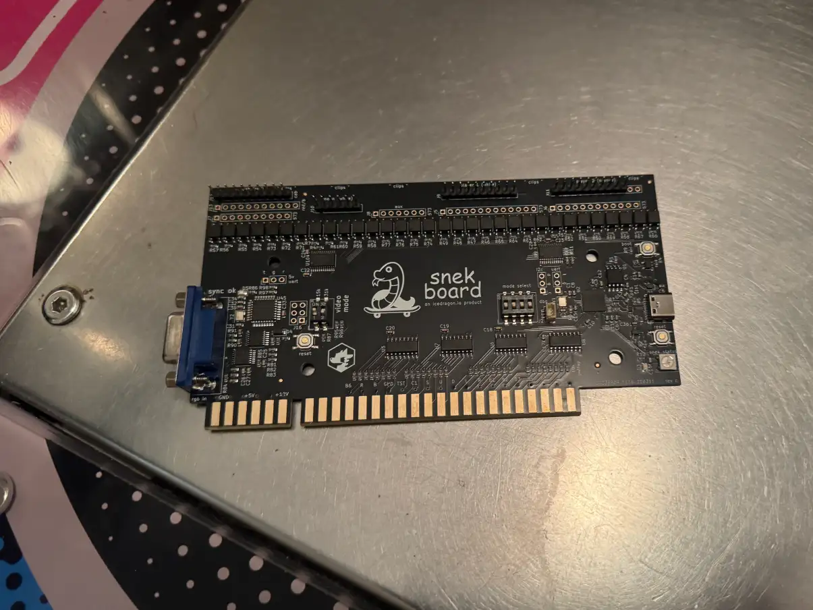
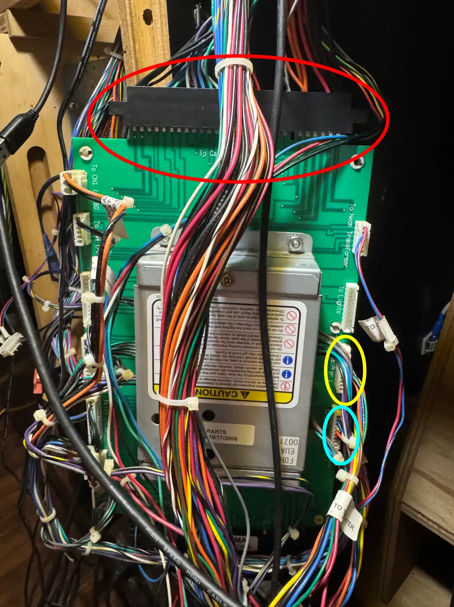
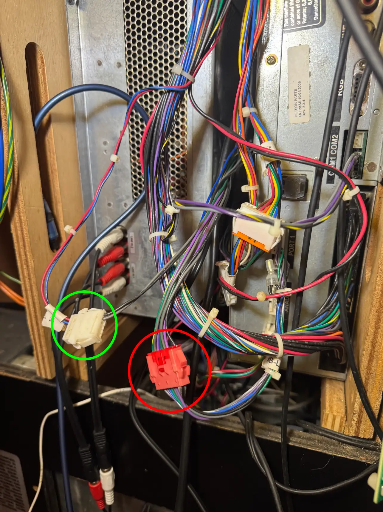
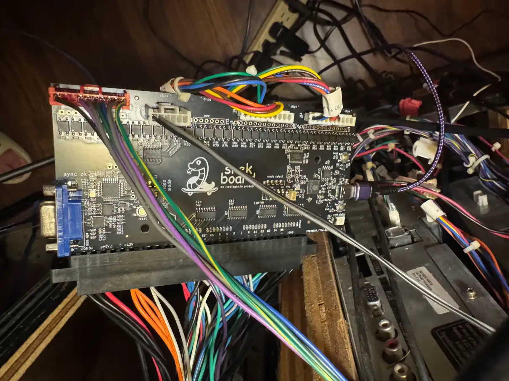
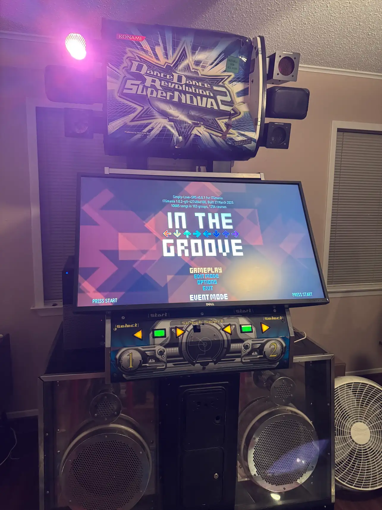
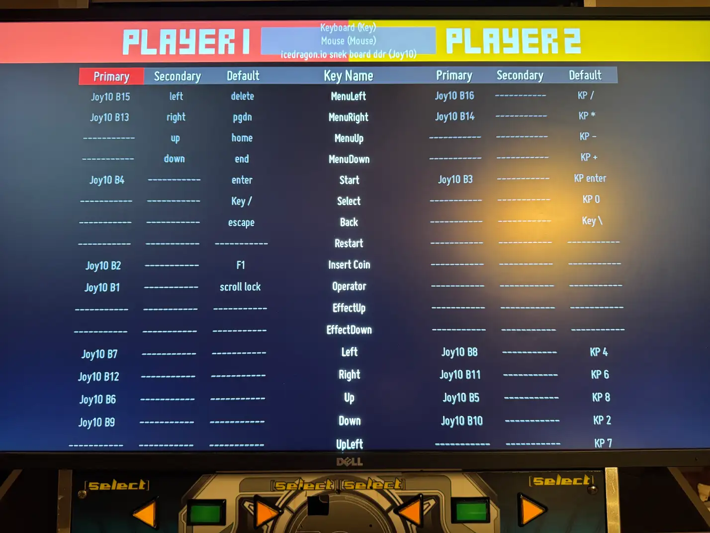

+++
date = '2025-08-01T23:39:26Z'
draft = false
title = 'snekboard Installation on DDR Supernova 2 Cabinet'
image = 'snekboard-installed.webp'
+++

## Introduction
Continuation of updating my DDR Supernova 2 cabinet with a P2IO and EXT-IO, I soon realized that a lot of new versions of [Project OutFox](https://projectoutfox.com/) and [ITGmania](https://www.itgmania.com/) were no longer supporting the P2IO driver in their builds. In fact, ITGmania did not support it at all and it had to be patched in afterwards. This annoyed me slightly not because I *needed* to have the latest version, but because there were fixes in later versions that I wanted to have. Mainly, they were updating ffmpeg and I still used videos in the background for a lot of my songs. Because they were using an older version of ffmpeg, sometimes the performance wasn't great and videos made the game feel choppy and laggy.

I decided to look elsewhere on how I can update my DDR cabinet to support newer versions for the future. There were options available such as a [J-PAC](https://www.ultimarc.com/control-interfaces/j-pac-en/j-pac-jamma-interface/) that were avaiable, but this does not run the lights for the cabinet. It is possible to use this in combination with something like the [LIT Board](https://icedragon.io/lit/) to get lights running. While researching and deciding, I saw the icedragion.io release a new board, the [snek board](https://store.icedragon.io/product/snek-board/). This seemed to fit everything I wanted. Seems like a [Minimaid](https://itgwiki.dominick.cc/en/hardware/pad-ios#minimaid) replacement, which was perfect. I didn't have an old CRT monitor so the video side of things were no longer a concern either. I just needed lights and inputs, it seems like the snek board was the perfect fit.

Along with this, I decided to switch to ITGmania as my main program. It seemed more focused on getting 4 panel games than Project OutFox, but I honestly didn't see much of a difference. Plus, it's [open source](https://github.com/itgmania/itgmania). While I typically like to roll my own everything, I found this [pre-build ITGmania image](https://docs.google.com/document/d/1_lO2ddaYogve08u7CsjC6OojXy36ZfGgo7VCRVkLJhU/edit?tab=t.0#heading=h.f4jo4mmoacz4) and it seemed to fit everything I needed. It has all the settings set up already, everything preconfigured. All I needed to do was put my own songs into it. This made the post-install much easier.

## Installation
The provided instuctions were pretty clear and through, but I still ran into issues installing it properly. It seems that my wiring was slightly different since the instructions only covered 573 JP cabs or newer red cabs. I was somewhere in the middle, but it was mostly the same as red cabs since I had an EXT-IO as well. For me, the correct cables to pull were the JAMMA harness from the EXT-IO (not the game), P1/P2 lights from the EXT-IO, cabinent lights (from the middle of the cab), and neons (from the middle of the cab). Luckily for me, most of these cables had a label on them making it easier to identify.

 

I initially pulled the neons from the EXT-IO, which made the cabinet neons not work. I then had to try to find other neon cables to turn them on. I found in the middle of the cabinet there was a cable that were for neons that I needed to use instead. Using this cable instead, the cabinet lights were working again!

I also initially pulled the JAMMA harnness from the game (P2IO), which did work but that meant that I had to run the EXT-IO. I found this out when I decided to unplug my EXT-IO and my pads were not working properly. Lights were working but both my UP and RIGHT arrows on the pads were stuck on all the time. I thought this was an issue with the snekboard, so I swapped back to the P2IO and Project OutFox, but then they were still not working. Until I plugged the EXT-IO back in, I realized that I needed that (of course I did). I then realized that I needed to pull the JAMMA harness that was running into the EXT-IO instead of the game. When I swapped this out, everything still worked.

## Setup
After following the instuctions on how to install the ITG image, I had a successful booting system. Lights seemed to work off the bat, but there were no inputs for buttons. Coming from the P2IO/EXT-IO setup, I assumed the game would recongize the inputs immediately. 

Turns out that I was too used to such a custom setup and that the snekboard passes inputs as a normal game controller. I needed to go the input mappings and map all my buttons, including my cabinent buttons.

## Conclusion
The snek board provided to pretty nice and useful. Easy to setup, though some instuctions weren't 100% clear for my specific setup. I haven't had any issues with the board itself and I'm finally running newer versions of ITGmania where my videos don't appear choppy and laggy.