+++
date = '2024-11-02T22:25:30-06:00'
draft = false
title = 'ADT-Link UT3G in Razer Core X'
image = 'razer-final-2.jpg'
+++

# Introduction
A while back I tried to use an eGPU setup so that I can have the one laptop for everything. I had a [Framework 13](https://frame.work) with an Intel 12th gen i7-1280p. I bought a [Razer Core X](https://www.razer.com/mena-en/gaming-laptops/razer-core-x) and stuck my video card, a [MSI Nvidia RTX 3080 Ti](https://www.msi.com/Graphics-Card/GeForce-RTX-3080-Ti-VENTUS-3X-12G-OC) in it. It worked fine but then I noticed that my laptop was constantly thermal throttling. Something about those 12th gen Intel chips *(sigh)*.

I finally upgraded my Framework 13 to the new one running an [Intel 14th gen Ultra 5 125H](https://frame.work/products/laptop13-diy-intel-ultra-1). This proved to be much better in the thermals department so I decided I would go for the eGPU setup once more. I was curious how my old setup held up againist time and it turns out that the Razer Core X is using old technology! It uses an old Thunderbolt 3 controller from 2015, [Intel Alpine Ridge](https://www.intel.com/content/www/us/en/products/sku/87402/intel-dsl6540-thunderbolt-3-controller/specifications.html)! 

I found out that [people](https://www.reddit.com/r/eGPU/comments/17vgjcc/egpu_thunderbolt_vs_usb4_adt_link_ut3g_tutorial/) had been doing testing with some newer adapters and that the new hot item was the [ADT-Link UT3G](https://www.adt.link/product/UT3G.html). This is a USB4 adapter and it runs on PCIe 4.0 Since my RTX 3080 Ti was also PCIe 4.0, I could take advantage of the higher bandwidth this adapter supports. Since it is USB4, it did not support USB PD for charging; but I was fine with that, I had another dongle that I was using for charging anyways that was a 'mini dock'.

# The Dilemma
The ADT-Link UT3G is really just a PCB on a board and it's not really the prettiest. On the other hand, the Razer Core X enclosure is pretty nice too look at. So ideally, I would try to put the ADT-Link UT3G into the Razer Core X. I was not the first to think of doing this, and it turns out I'm [not the first](c:\Users\Daniel Tam\Desktop\ddr-install\razer1.jpg) to think of this.

Turns out with the PSU within the Razer Core X, it sits flush along the UT3G. While that may not sound like a problem initially, it turns out that the UT3G has the power and USB connector sitting on the side that faces the PSU. This means that there's no space to plug in power nor the USB cable!

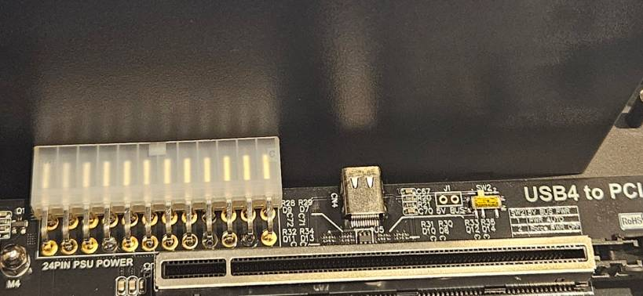

Well, the UT3G does fit within the Razer Core X enclosure, so it's not exactly the end of this idea. If I switched to a smaller PSU, in the SFX format rather than the ATX format, it would solve that dilemma. While it may not have the exact same look with the different hardware within the enclosure, it would still look good from the front and sides, just not the back. I figured that since I have a 3D printer, I could print some way to mount the UT3G within the enclosure, and print some way to mount the PSU.

# Hardware
I wanted to reuse as much hardware as I could. This meant screws and mounts were all re-used from what was on both the UT3G and Razer Core X. I had a spare SFX power supply I wasn't using as well which meant the only piece I had to purchase was a power cable.

- [ADT-Link UT3G](https://www.aliexpress.us/item/3256806035240326.html?gatewayAdapt=glo2usa4itemAdapt)
- [Razer Core X](https://www.razer.com/mena-en/gaming-laptops/razer-core-x)
- [Corsair SF600 SFX Power Supply](https://www.amazon.com/CORSAIR-SF600-Modular-Supply-Certified/dp/B01CGI5M24)
- Corsair 120mm Fan (the one within the Razer Core X can be re-used)
- [Left angle power cable](https://www.amazon.com/Tripp-Lite-Standard-IEC-320-C13-P006-006-13LA/dp/B003MGB1EI?crid=EAC9Z5IEBPPW)
- 3D Printer

# The Build
If anyone is trying to replicate this build, it'll probably be best to 3D print all the parts first. I used PETG but I'm sure PLA will be fine, it was just what I had in my printer at the moment. I doubt it'll get hot enough in the enclosure that PLA will be an issue.

## 3D Printed Parts
These the STL files for the 3D printed parts. I'm not a CAD artist by any means so they're all very **very** basic shapes:
- [Bottom plate](razer-bottom-plate-full.stl): This mounts the UT3G into the enclosure
- [Fan stand](razer-fan-stand.stl): This mounts the 120mm fan into the enclosure and has a bracket to help support the PSU
- [PSU holder](razerx-pus-holder-5.stl): This mounts the SFX PSU

## Disassembly
I had to first remove all parts and screws from **both** the UT3G and the Razer Core X. I wanted to re-use the screw it came with so I tried to design everything around these.

Once fully disassembled, it should look like:

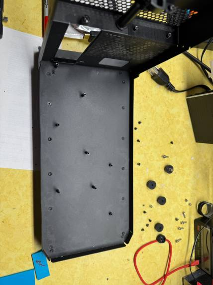

## Assembly
With the 3D printed bottom plate and the same screws that held down the Razer Core X PCB, I could begin to mount the UT3G PCB. Just have to make sure to put in the long screws that hold the GPU in because you won't be able to fit it in afterwards.

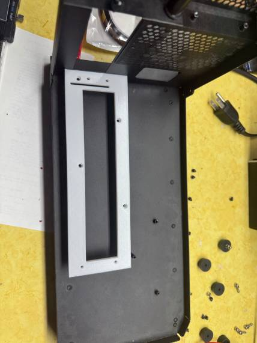 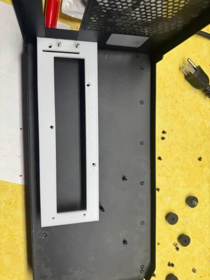 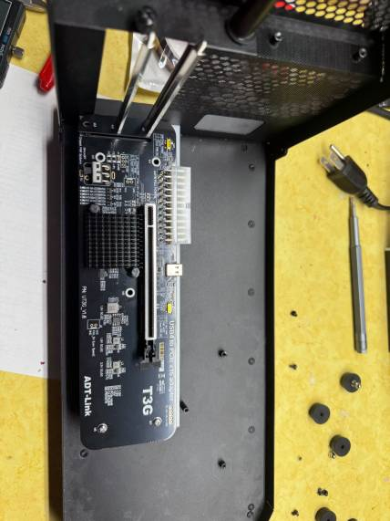

Next up, the fan holder. I once again used the short screws that the Razer Core X had to hold down the fan bracket plate. I then also used the rubber feet from the UT3G to hopefully help with the vibration of the fan.

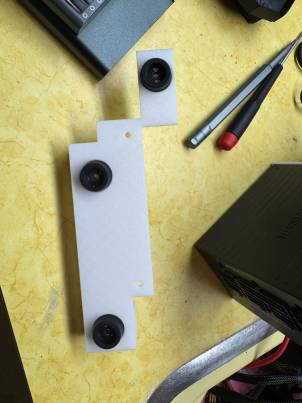 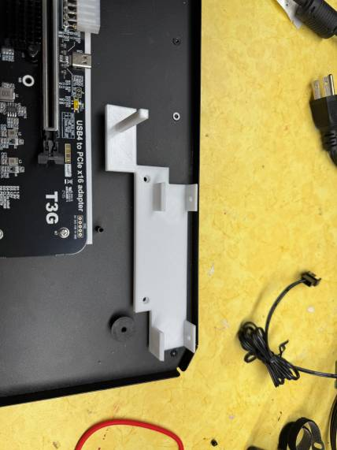 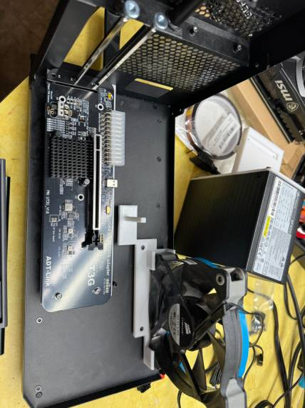

Finally, the power supply. I used the same screws and mounting poles that the original power supply used. This power supply will "hover" in the air. The fan bracket has a support pole to help the PSU from just breaking the bracket.

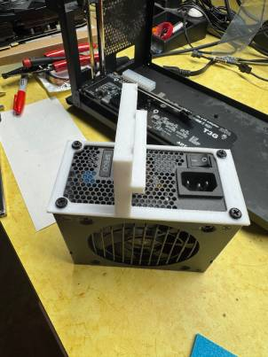 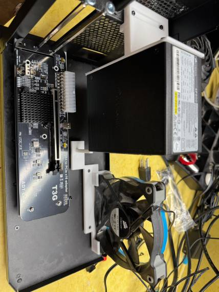

The final assembly should look like:

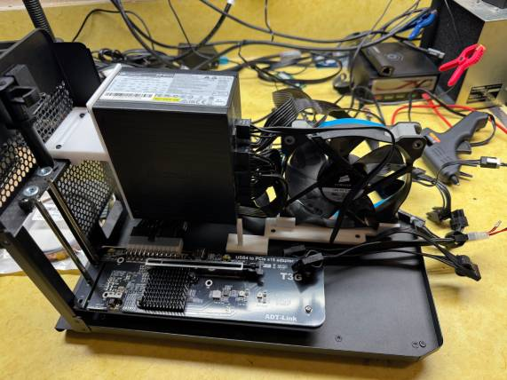 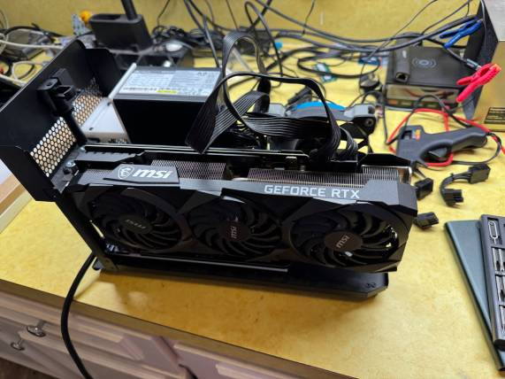

This should fit back into the enclosure, and with my GPU, it was a bit **snug**. But it worked. The back is not the prettiest but no one should ideally be looking at the back of the device.

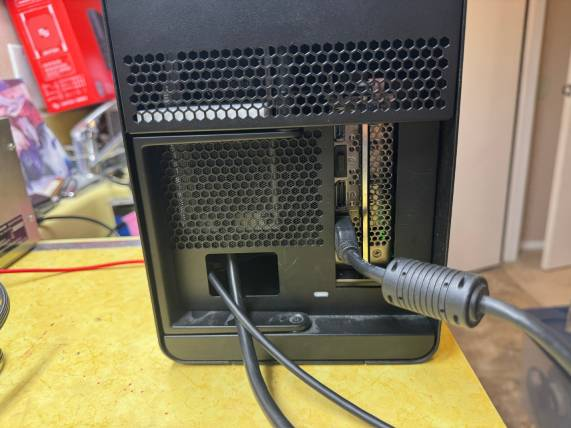 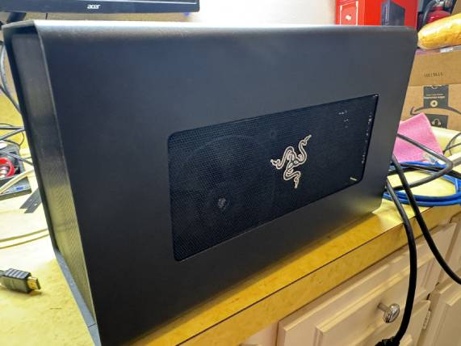

I have yet to benchmark this and see how performance is with my setup. But I have played some games (CS2) and it seemed to perform well enough for my taste at the time being.